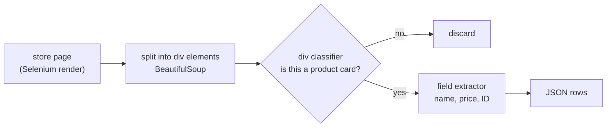
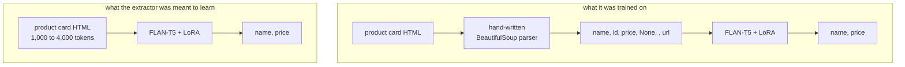

Price-comparison sites, stock trackers and shopping assistants all need the
same boring thing: the name, price and product ID of everything a store sells.
South African retailers don't publish that as data. It lives in their web
pages, wrapped in whatever markup each store's front-end team chose.

Here is one product card from Woolworths, and what I actually wanted out of it:

{: .no-invert}

Three values, buried in 2,333 characters of layout classes, inline CSS and empty
promotion slots. Even the price is split by an HTML comment (`R <!-- -->400.00`).
The usual answer is a hand-written parser per store, which breaks every time a
store redesigns and has to be rewritten for every new store. The goal of this
project, which ran from November 2022 to September 2023, was a model that reads
any store's HTML and returns those fields.

It didn't get there. This post is about what was built, what the data turned out
to look like, and what went wrong, because the failures are more useful than a
demo would have been.

Code: [github.com/matikasiyanda/retail-html-extraction](https://github.com/matikasiyanda/retail-html-extraction)

## What "any store" looks like

The scrapers drive Chrome through Selenium [[Selenium]](#references), wait three
seconds for JavaScript to render the page, and hand the source to BeautifulSoup
[[BeautifulSoup]](#references). Every store needs its own CSS selector to say
which `<div>` is a product card:

| site | what a product card is |
|---|---|
| Woolworths | `div.product-list__item` |
| Pick n Pay | `div.productCarouselItemContainer` |
| Dis-Chem | `div[data-container="product-grid"]` |
| Clicks | `div[class="productBlock"]` |
| Takealot | `div[class="cell small-4"]` |
| cars.co.za | `div[class="ga-used-car-search-result"]` |

Those selectors are exactly the per-store knowledge a model was supposed to make
unnecessary. The scraper uses them to label its own training data: every `<div>`
matching the selector is a product card (1), everything else on the page is not
(0).

```python
def divClassifier(url, divInfo, storeName):
    raw_html = extract_html(url)          # Selenium, then driver.page_source
    theSoup = parse_html(raw_html)
    divs = theSoup.find_all('div')
    withItems = theSoup.select(divInfo)   # the store's product-card selector
    noItems = [div for div in divs if div not in set(withItems)]
    ...
```

Clemence Mungwariri wrote the notebook that extended scraping from the two
grocery stores to Clicks, Dis-Chem, Takealot and cars.co.za. By the last round
the data covered 16 sites, and the first thing it showed was how rare the thing
we were looking for is:


Across all 16 sites, 2,486 of 258,546 divs are product cards: under 1%. Most of
a store page is navigation, filters, banners, scripts and wrappers. Any model
that looks at divs one at a time is mostly looking at noise.

The second thing the data showed is how long a single product card is. Measured
with FLAN-T5's own tokenizer on 600 real cards per store:


Every card from both stores is longer than FLAN-T5's 512-token input. A Pick n
Pay card is about seven times too long. That number explains a lot of what
follows.

## The plan

The design that took shape was a two-stage pipeline, so the expensive
extraction model would only ever see product cards:



Three approaches were tried at the extraction step, in order.

## Attempt 1: spaCy NER (November 2022)

The first idea was named-entity recognition [[NER]](#references): flatten a
product card to text, and tag the characters that are the name and the price.
The Woolworths scrape gave 1,444 cards. For each one the scraper recorded where
the name and price strings sit inside the flattened text, and 1,378 cards had a
name to tag. Those became spaCy [[spaCy]](#references) training documents, 965
for training and 413 for testing, with a `roberta-base` [[RoBERTa]](#references)
transformer feeding an NER head.

The model reported an F1 of 0.84. Reading the training notebook again, that
number doesn't mean what it looks like. The label on each span was the product's
own text (simplified from the notebook):

```python
all_ = {'entities': [(row['name_loc'][0], row['name_loc'][1], row['name']),
                     (row['price_loc'][0], row['price_loc'][1], row['price'])], ...}
```

The third element of each tuple is the entity *type*. It should have been
`"NAME"` or `"PRICE"`. Instead every product name and every price string became
its own type, 1,124 of them, like `" 100% Coconut Water 1 L"` and
`" Angus Beef Denver Steak Avg 400 g"`. A model with those labels can only
recognise products it has already seen, which is the opposite of the point.

## Attempt 2: FLAN-T5-XL with LoRA (mid 2023)

The second design used an instruction-tuned model, `google/flan-t5-xl`
[[FLAN-T5]](#references), with two LoRA adapters [[LoRA]](#references) (rank 8
on the attention q and v projections, learning rate 5e-4, 3 epochs, effective
batch 128), trained with the `flan-alpaca-lora` script
[[flan-alpaca-lora]](#references). One adapter would classify divs, the other
would extract fields.

### The extractor

Labels came from hand-written BeautifulSoup parsers, one per store:

```python
def woolworths_parse(x):
    name = x.select_one('.product-card__name').text
    product_code = x.select_one('div.prod_details.swatch-box').get('id')
    current_price = x.select_one('div.product__price strong.price').text
    ...
```

That produced 11,526 examples from 7,397 Woolworths and 4,129 Pick n Pay
cards. Here is one, exactly as it appears in the data file:

```json
{
  "instruction": "Return product information ",
  "input": "First Choice Low Fat Uht Milk 1l, 000000000000204113_EA, R19.99, None, , /pnpstorefront/pnp/en/All-Products/Food-Cupboard/Long-Life-Milk/...",
  "output": "First Choice Low Fat Uht Milk 1l, R19.99"
}
```

Look at the input. It isn't HTML. It's the parser's output, the fields already
extracted and joined with commas. Given 3,706 tokens of Pick n Pay markup and a
512-token model, feeding it the parsed fields is the only thing that fits, but
it changes the task completely. The model is being taught to copy the first and
third items out of a comma-separated list:



The hand-written parser, the thing the model was meant to replace, is still
doing all of the reading.

The inference notebook saved 337 predictions on the test file. 335 match the
reference exactly, 99.4%. The two misses are telling in their own way: one
answer echoed part of the instruction (`"product information PnP Mild Dill Tail
Gherkins 270g, R34.99"`), and one misspelled `"Barilla Spaghettiini"`.

That 99.4% is not a result, for three reasons found later. The task was copying
from a parsed list, not reading HTML. The saved training script points
`--data_path` at the test file, and the adapter was written after that file
was, so the model was very likely scored on data it trained on. And the train/test split
took the first 10,373 rows and the last 1,153 without shuffling, so every test
example is from Pick n Pay and none from Woolworths.

### The div classifier

The classifier's data came from the scraper's 1/0 labels over 384,729 divs from
Woolworths Food and Pick n Pay. The script builds a balanced set, every product
card plus an equal number of other divs, then writes out something else:

```python
dy = pd.concat([w_1, w_0, p_0, p_1])   # balanced
dy = dy.sample(frac=1)
xu = [dict(v) for _, v in df[["instruction", 'input', 'output']].iterrows()]  # df, not dy
json.dump(xu[:20_000], f)
```

It saves the first 20,000 rows of the *original* table, `df`, not the balanced
`dy`:


A classifier that answers "not a product card" to every input scores 98.2% on
that file. It gets worse. An earlier line cuts every input to its first 200
characters, about 90 tokens. On Pick n Pay cards the product name first appears
around character 1,570; on Woolworths, around character 798. Of 11,526 product
cards, the name falls inside the first 200 characters for 14 of them, all
Woolworths. The classifier was asked to recognise product cards from the part
of the HTML that contains no product.

## Attempt 3: more sites, GPT-3.5 as the labeller (August to September 2023)

Hand-written parsers were the bottleneck: each new store needed one before it
could produce training data. So the last round went wide, to the 16 sites in the
chart above, and used GPT-3.5 to write the labels instead
[[LLM-labels]](#references). Each product card was sent with this instruction:

```
from the given html snippet extract for me item_name, item_price, item_id,
item_promotion, item_promo_price, item_url (output as json format only):
```

The saved responses show what "JSON only" means in practice. Of 2,824 responses:

| response shape | count |
|---|---|
| bare JSON, as asked | 2,509 |
| a sentence of prose first, then JSON | 268 |
| JSON inside a markdown code fence | 119 |
| contains an `item_name` field at all | 2,818 |

The fields themselves weren't consistent either. Missing promotions came back
as `null` in some responses and `""` in others. Two Dis-Chem products, one after
the other, came back with IDs in different formats:

```json
{ "item_name": "Caltrate Plus 60 Tablets",
  "item_price": "R 259.95",
  "item_id": "000000000000003811",
  "item_promotion": null }

{ "item_name": "Centrum Multivitamin Select 50+ Vitality 90 Tablets",
  "item_price": "R 469.95",
  "item_id": "50688",
  "item_promotion": "" }
```

None of that is fatal. It's a parsing layer and a normalisation pass. But it
means an LLM labeller moves the per-store work rather than removing it. This
labelled set was meant to train the next extractor. The project stopped here.

## The long-context idea that didn't run

One notebook points at where this was heading. It tokenises a single Pick n Pay
card with GPT-NeoX's tokenizer, gets 1,930 tokens, and then loads
`mosaicml/mpt-7b-chat-8k` with its maximum sequence length raised to 16,384.
That's the right instinct given the length chart above: if a card is thousands
of tokens, use a model that can read thousands of tokens. No results were
saved from it.

## What a review of the code found

I went back through all of this in 2026 while putting the code on GitHub. None
of these problems throws an error. The code runs, and a sample prediction looks
right.

| # | problem | effect |
|---|---|---|
| 1 | NER labels are each product's own text | 1,124 entity types; F1 of 0.84 measures memorisation |
| 2 | classifier saves `df` instead of the balanced `dy` | 1.8% positives; "always no" scores 98.2% |
| 3 | classifier inputs cut to 200 characters | product name missing from 99.9% of positive examples |
| 4 | extractor input is the parser's output, not HTML | model learns to copy fields, parser still does the reading |
| 5 | training script points at the test file; split not shuffled | 99.4% is very likely on training data, all from one store |

## If I did it again

Most of these problems come from one missing piece: an evaluation that runs
before any training, on data the model can't have seen. Concretely:

1. **Freeze a test set first.** A few hundred product cards from stores kept
   out of training entirely, labelled by hand, with the metric defined as exact
   match on name and price.
2. **Measure the input before choosing the model.** The token-length chart takes
   ten minutes to make and rules out a 512-token model immediately.
3. **Shrink the HTML instead of truncating it.** Strip scripts, styles, empty
   divs and attributes other than `class` and `id` before tokenising. Most of a
   card's length is markup a model doesn't need.
4. **Use a long-context model for extraction** and keep the parsers only as a
   labelling tool for the training set, never as part of the input.

## References

- **[NER]** Lample et al., *Neural Architectures for Named Entity Recognition*,
  NAACL 2016. arXiv:1603.01360.
- **[spaCy]** Honnibal, Montani, Van Landeghem & Boyd, *spaCy:
  Industrial-strength Natural Language Processing in Python*, 2020.
  <https://spacy.io>
- **[RoBERTa]** Liu et al., *RoBERTa: A Robustly Optimized BERT Pretraining
  Approach*, 2019. arXiv:1907.11692.
- **[FLAN-T5]** Chung et al., *Scaling Instruction-Finetuned Language Models*,
  2022. arXiv:2210.11416.
- **[LoRA]** Hu et al., *LoRA: Low-Rank Adaptation of Large Language Models*,
  2021. arXiv:2106.09685.
- **[flan-alpaca-lora]** Reason-Wang, *flan-alpaca-lora*. The training script
  used for both adapters. <https://github.com/Reason-Wang/flan-alpaca-lora>
- **[LLM-labels]** Gilardi, Alizadeh & Kubli, *ChatGPT Outperforms Crowd-Workers
  for Text-Annotation Tasks*, PNAS 120(30), 2023. arXiv:2303.15056.
- **[MPT]** MosaicML NLP Team, *Introducing MPT-7B: A New Standard for
  Open-Source, Commercially Usable LLMs*, 2023. <https://www.databricks.com/blog/mpt-7b>
- **[Selenium]** SeleniumHQ, *Selenium WebDriver*. <https://www.selenium.dev>
- **[BeautifulSoup]** L. Richardson, *Beautiful Soup*.
  <https://www.crummy.com/software/BeautifulSoup/>
