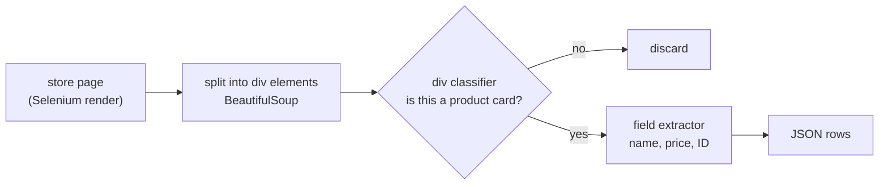

Price-comparison sites, stock trackers and shopping assistants all need the
same boring thing: the name, price and product ID of everything a store sells.
South African retailers don't publish that as data. It lives in their web
pages, wrapped in whatever markup each store's front-end team chose.

Here is one product card from Woolworths, and what I actually wanted out of it:

{: .no-invert}

Three values, buried in over two thousand characters of layout classes, inline
CSS and empty promotion slots. Even the price is split by an HTML comment
(`R <!-- -->400.00`). Pick n Pay wraps the same information in
`productCarouselItemContainer`, Dis-Chem in `product-item-info`, each with its
own nesting. The usual answer is a hand-written parser per store, which breaks
every time a store redesigns. I wanted a model that reads any store's HTML and
returns those fields.

Code: [github.com/matikasiyanda/retail-html-extraction](https://github.com/matikasiyanda/retail-html-extraction)

## Getting the HTML

The scrapers drive Chrome through Selenium, wait three seconds for the page to
render, and hand the source to BeautifulSoup:

```python
def divClassifier(url, divInfo, storeName):
    raw_html = extract_html(url)          # Selenium, then driver.page_source
    theSoup = parse_html(raw_html)
    divs = theSoup.find_all('div')
    withItems = theSoup.select(divInfo)   # the store's product-card selector
    noItems = [div for div in divs if div not in set(withItems)]
    ...
```

That gives every `<div>` on a page a label: 1 if it matches the store's
product-card selector, 0 otherwise. Across Woolworths Food and Pick n Pay it
produced 384,729 labelled divs. Clem wrote the notebook that extended scraping
to five stores, Clicks and Dis-Chem among them.

The plan that took shape over the three attempts below was a two-stage
pipeline, so the expensive extraction model only ever sees product cards:



## Attempt 1: spaCy NER (Nov 2022)

The first idea was named-entity recognition: flatten a product card to text and
tag the name and price spans [[NER]](#references). I built spaCy
[[spaCy]](#references) docs from 1,378 Woolworths cards
(965 train, 413 test) and trained a `roberta-base` [[RoBERTa]](#references) transformer with an
NER head.

It reported an F1 of 0.84. Reading the training notebook again, that number
doesn't mean what it looks like. The label on each span was the product's own
text (simplified from the notebook):

```python
all_ = {'entities': [(row['name_loc'][0], row['name_loc'][1], row['name']),
                     (row['price_loc'][0], row['price_loc'][1], row['price'])], ...}
```

The third element should have been `"NAME"` and `"PRICE"`. Instead the model
learned 1,124 entity types, one per product and price string in the training
set, which tells you nothing about a product it hasn't seen.

## Attempt 2: FLAN-T5-XL with LoRA (mid 2023)

The second design split the job in two, both as text-to-text tasks on
`google/flan-t5-xl` [[FLAN-T5]](#references) with LoRA adapters
[[LoRA]](#references) (rank 8 on the attention q and v projections, learning rate 5e-4, 3 epochs, effective batch 128):

1. **Is this `<div>` a product card?** Input: the div's HTML. Output: `1` or `0`.
2. **What's in it?** Input: a product card. Output: `name, price`.

Labels for the extractor came from hand-written BeautifulSoup parsers, one per
store:

```python
def woolworths_parse(x):
    name = x.select_one('.product-card__name').text
    product_code = x.select_one('div.prod_details.swatch-box').get('id')
    current_price = x.select_one('div.product__price strong.price').text
    ...
```

That produced 10,373 training and 1,153 test pairs like
`"Return product information" → "First Choice Low Fat Uht Milk 1l, R19.99"`.

Both adapters trained, and a quick check on a Woolworths card returned `1`.
There was never a proper evaluation, and the review below explains why the
numbers wouldn't have meant much anyway.

## Attempt 3: more stores, GPT-3.5 labels (Aug–Sep 2023)

Hand-written parsers don't scale past a handful of stores, which was the whole
problem. So the last round went wider (Dis-Chem, Bash, Truworths and others)
and used GPT-3.5 as the labeller [[LLM-labels]](#references). Out of 258,546 scraped divs, 2,486 were
product cards, and GPT-3.5 turned each into JSON with item name, price, ID,
promotion, promo price and URL. That set was meant to train the next extractor.
The project stopped there.

## What a review of the code found

I went back through the code in 2026 while putting it on GitHub. Three things
would have sunk any result:

- **The NER labels**, above.
- **The classifier data wasn't balanced.** The script carefully builds a
  balanced set (every product card plus the same number of non-product divs,
  23,052 rows), then writes out the first 20,000 rows of the *original* table
  instead. The file the classifier trained on is 1.8% product cards (360 of
  20,000), and every input is cut to 200 characters.

  

  A classifier that answers "not a product card" to everything scores 98.2%
  on that file.

  ```python
  dy = pd.concat([w_1, w_0, p_0, p_1])   # balanced
  dy = dy.sample(frac=1)
  xu = [dict(v) for _, v in df[["instruction", 'input', 'output']].iterrows()]  # df, not dy
  json.dump(xu[:20_000], f)
  ```

- **The extractor trained on the test file.** `train_extraction_model.sh` passes
  `--data_path ./QnA_retail-data__test.json`: 1,153 rows, not the 10,373 in the
  train file.

None of these throw an error. The code runs and a sample prediction looks
right.

## If I did it again

Evaluate from day one on a fixed set of pages, including stores the model
never trained on. A single honest number early on would most likely have
exposed all three problems.

## References

- **[NER]** Lample et al., *Neural Architectures for Named Entity Recognition*,
  NAACL 2016. arXiv:1603.01360.
- **[spaCy]** Honnibal, Montani, Van Landeghem & Boyd, *spaCy:
  Industrial-strength Natural Language Processing in Python*, 2020.
  <https://spacy.io>
- **[RoBERTa]** Liu et al., *RoBERTa: A Robustly Optimized BERT Pretraining
  Approach*, 2019. arXiv:1907.11692.
- **[FLAN-T5]** Chung et al., *Scaling Instruction-Finetuned Language Models*,
  2022. arXiv:2210.11416.
- **[LoRA]** Hu et al., *LoRA: Low-Rank Adaptation of Large Language Models*,
  2021. arXiv:2106.09685.
- **[flan-alpaca-lora]** Reason-Wang, *flan-alpaca-lora*. The training script
  used for both adapters. <https://github.com/Reason-Wang/flan-alpaca-lora>
- **[LLM-labels]** Gilardi, Alizadeh & Kubli, *ChatGPT Outperforms Crowd-Workers
  for Text-Annotation Tasks*, PNAS 120(30), 2023. arXiv:2303.15056.
- **[Selenium]** SeleniumHQ, *Selenium WebDriver*. <https://www.selenium.dev>
- **[BeautifulSoup]** L. Richardson, *Beautiful Soup*.
  <https://www.crummy.com/software/BeautifulSoup/>
