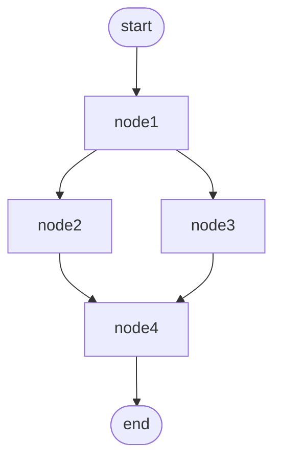
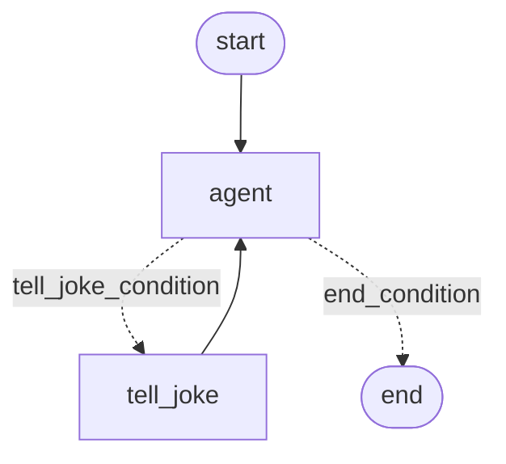
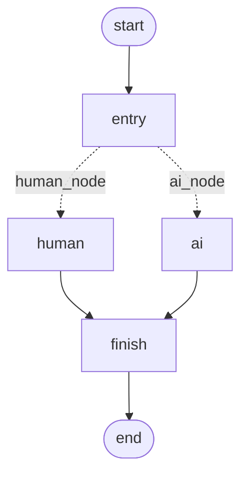

Most agent code ends up as a pile of `if` statements deciding what the model
should do next. LangGraph's idea is to draw that as a graph instead: each step
is a node, each "what happens next" is an edge, and some edges choose their
destination at run time. I learned it by writing the three smallest graphs I
could think of, one per concept.

Code: [github.com/matikasiyanda/langchain_related](https://github.com/matikasiyanda/langchain_related)

These use `MessageGraph`, which was the simple entry point in 2024. It has
since been deprecated in favour of `StateGraph` with a `messages` key, but the
node, edge and routing ideas carry over unchanged.

## The four pieces

A **node** is a plain Python function. In a `MessageGraph` it receives the list
of messages so far and returns messages.

An **edge** says which node runs after which. `END` is a special node that
stops the graph.

A **conditional edge** takes a routing function. The function looks at the
current messages and returns a label, and a dict maps each label to a node.

**Compiling** turns the definition into a runnable object with `.invoke()`. It
also checks the wiring: add a node that no edge reaches and `compile()` raises
``ValueError: Node `orphan` is not reachable``.

## Graph 1: a diamond

Four nodes that all do the same thing, wired so the middle two run side by
side:

```python
from langgraph.graph import END, MessageGraph

def add_text(input):
    input[0].content += " Amazing"
    return input

graph = MessageGraph()
for name in ["node1", "node2", "node3", "node4"]:
    graph.add_node(name, add_text)

graph.add_edge("node1", "node2")
graph.add_edge("node1", "node3")
graph.add_edge("node2", "node4")
graph.add_edge("node3", "node4")
graph.add_edge("node4", END)
graph.set_entry_point("node1")

runnable = graph.compile()
print(runnable.invoke("AI is "))
```

`runnable.get_graph().draw_mermaid()` gives the shape:



Running it with `langgraph` 0.2.28 prints one message:

```
AI is  Amazing Amazing Amazing Amazing
```

Four nodes, four "Amazing"s, and `node4` runs once even though two edges lead
into it. LangGraph waits for both branches and runs the join node a single
time.

The count is right for a reason worth knowing, though. `add_text` doesn't
create a new message; it edits `input[0]` in place and hands back the same
object. `MessageGraph` merges messages by ID, so when `node2` and `node3` both
return "their" message, it's one message with one ID that both of them
modified. The parallel branches aren't producing two results that get combined.
They're sharing a mutable object.

Make each node return a new message instead and the real behaviour shows:

```
HumanMessage  'AI is '
AIMessage     'node1 saw 1 message(s)'
AIMessage     'node2 saw 2 message(s)'
AIMessage     'node3 saw 2 message(s)'
AIMessage     'node4 saw 4 message(s)'
```

`node2` and `node3` run in the same step and neither sees the other's output.
Their results are appended together, and only `node4` sees everything. That's
the rule to design parallel tool calls around.

## Graph 2: a loop with a stopping rule

A conditional edge that sends control back to an earlier node makes a loop.
This one asks a model for jokes until it has told ten:

```python
from langchain_core.messages import HumanMessage
from langchain_openai import ChatOpenAI
from langgraph.graph import END, MessageGraph

# any OpenAI-compatible endpoint serving llama3.1
chatmodel = ChatOpenAI(base_url="http://localhost:11434/v1", api_key="unused", model="llama3.1")

joke_call_count = 0

def agent(input):
    return input

def tell_joke(input):
    global joke_call_count
    joke_call_count += 1
    print(chatmodel.invoke(input).content)
    return input

def route(input):
    return "tell_joke_condition" if joke_call_count < 10 else "end_condition"

graph = MessageGraph()
graph.add_node("agent", agent)
graph.add_node("tell_joke", tell_joke)
graph.add_conditional_edges("agent", route,
                            {"tell_joke_condition": "tell_joke", "end_condition": END})
graph.add_edge("tell_joke", "agent")
graph.set_entry_point("agent")

runnable = graph.compile()
runnable.invoke([HumanMessage(content="tell me a joke about nature! keep it funny!")],
                {"recursion_limit": 100})
```



Two things to notice. The `recursion_limit` is LangGraph's guard against a
loop that never stops: every node execution counts as a step, and ten jokes
take about twenty. And the counter lives in a Python global, outside the
graph. That works for a demo, but the graph can't see it, save it or reset it
between runs. The next thing to learn after this is putting that counter into
the graph's own state.

## Graph 3: a branch

A conditional edge that doesn't loop is just a fork. The router picks one of
two paths, and both paths meet at a shared final step:

```python
def entry(input):  return input
def human(input):  input[0].content += " is not Amazing"; return input
def ai(input):     input[0].content += " is Amazing"; return input
def finish(input): input[0].content += " always!"; return input

def route(input):
    return "human_node" if input[0].content == "human" else "ai_node"

graph = MessageGraph()
for name, fn in [("entry", entry), ("human", human), ("ai", ai), ("finish", finish)]:
    graph.add_node(name, fn)

graph.add_conditional_edges("entry", route, {"human_node": "human", "ai_node": "ai"})
graph.add_edge("human", "finish")
graph.add_edge("ai", "finish")
graph.add_edge("finish", END)
graph.set_entry_point("entry")
runnable = graph.compile()
```



```
invoke("human")  →  human is not Amazing always!
invoke("ai")     →  ai is Amazing always!
```

Unlike the diamond, only one branch runs. Swap the string comparison for a
model call that classifies the question, and this is the skeleton of a router
agent.

## What the three add up to

Parallel branches, loops and forks cover most agent designs. "Call a
tool, look at the result, decide whether to call another" is Graph 2. "Answer
directly or go and search first" is Graph 3. The value of writing it as a graph
is that the control flow becomes something you can print, draw and test on its
own, without a model in the loop. Graphs 1 and 3 above run with no LLM at all,
so the outputs shown here come from actually running them.
