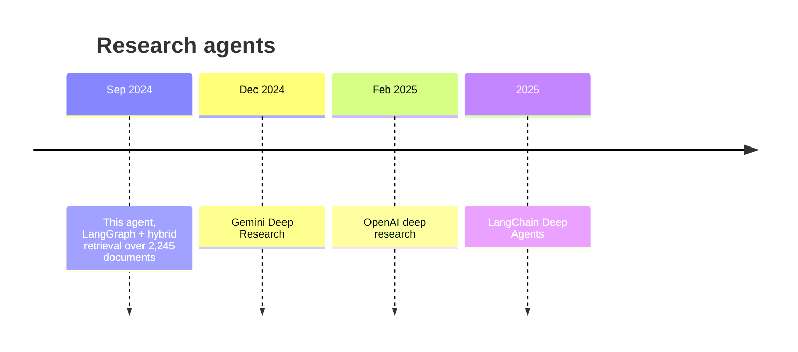
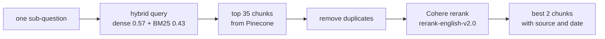
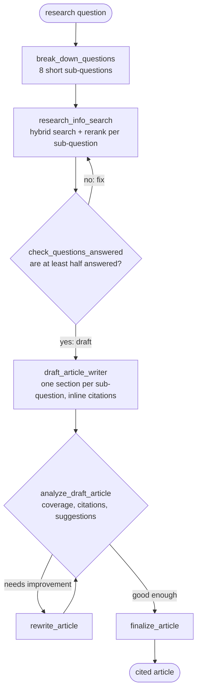
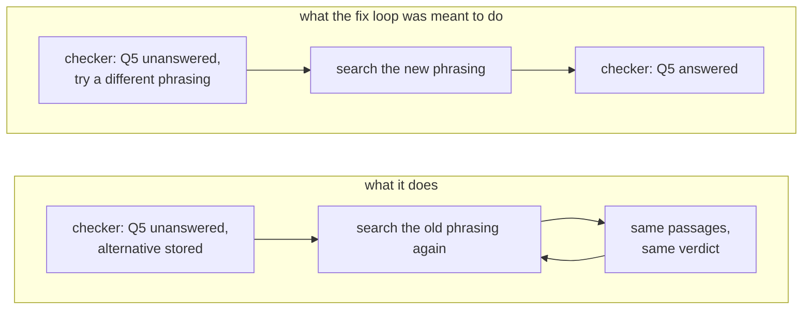

Ask a plain retrieval system something like *"Compare how Party A and Party B
plan to grow the economy"* and it does one search for the whole sentence. The
top results are whichever passages happen to mention both parties and the
economy, which is usually a news summary, not the two manifestos. The question
is really eight questions: what each party proposes on jobs, on
infrastructure, on education, on the environment, and how they differ. No
single search answers it.

In September 2024 we built an agent that treats a research question the way a
person would. It writes a research plan as a list of sub-questions, searches
for each one separately, checks whether the evidence actually answers them,
writes a draft with a citation on every claim, reviews its own draft, and
rewrites it until the review passes. Today that pattern has a name. Google
shipped Gemini Deep Research in December 2024 [[GeminiDR]](#references), OpenAI
shipped deep research in February 2025 [[OpenAIDR]](#references), and LangChain
later packaged the approach as *Deep Agents* [[DeepAgents]](#references). This
agent was running on 30 September 2024.

The subject was a national election. Party names below are replaced with
"Party A" and "Party B".

Code: [github.com/matikasiyanda/research-agent-langgraph](https://github.com/matikasiyanda/research-agent-langgraph)



## The corpus

The agent searched a private index rather than the web: everything the
parties, candidates and electoral authorities published in the run-up to the
election, plus reference material.


Most documents are transcripts and posts from party channels, 2,126 text files
with a median size of about 3.7 KB. The 57 PDFs are the heavy ones: full
manifestos and policy documents. Every filename carries its source and date in
a fixed pattern, `Source^^YYYYMMDD^^title.ext`, so each chunk can be cited with
who published it and when.

## Indexing: two kinds of search in one index

Each document is split with LangChain's recursive splitter into chunks of 400
with an overlap of 20, and the source line is appended to the chunk's text
itself, not only its metadata. That small choice means the citation travels
with the text through every later step, including reranking, where metadata is
often dropped.

Every chunk gets two vectors. A dense one from OpenAI's `text-embedding-3-small`
[[Embeddings]](#references) captures meaning, so "job creation" finds
"employment programmes". A sparse BM25 vector [[BM25]](#references) captures
exact words, which matters for names, programme titles and numbers that
embeddings blur. Both go into one Pinecone index [[Pinecone]](#references), and
a query weights them against each other:

```python
def hybrid_scale(dense, sparse, alpha: float):
    # alpha = 1 is pure semantic search, alpha = 0 is pure keyword search
    hsparse = {'indices': sparse['indices'],
               'values':  [v * (1.0 - alpha) for v in sparse['values']]}
    hdense = [v * alpha for v in dense]
    return hdense, hsparse
```

The agent uses `alpha = 0.57`, leaning slightly towards meaning. One detail we'd
change: the BM25 encoder uses term weights pre-fitted on MS MARCO
[[BM25Encoder]](#references), a web search dataset, rather than weights fitted on
this corpus. A party's own name is a rare, highly informative word in general web
text but appears in hundreds of documents here, and MS MARCO's weights don't
know that.

## One search, per sub-question

For every sub-question, retrieval is a funnel:



Thirty-five candidates is wide on purpose. Hybrid scores are cheap and rough,
so the net goes wide, and a cross-encoder reranker [[Rerank]](#references) that
reads the query and each passage together picks the two that actually answer
it. Two passages per sub-question sounds small, but with eight sub-questions the
writer gets sixteen focused, cited passages instead of thirty loosely related
ones.

## The graph

The agent is a LangGraph [[LangGraph]](#references) state machine with seven
nodes and two loops. The shared state holds the research prompt, the
sub-questions, the evidence, the current draft, the reviewer's feedback, and
counters for steps and rewrites.



A Streamlit app wraps the graph: you type a question, watch each node report its
progress as the graph streams, and read the finished article at the end.

Every model call uses `gpt-4o-mini` at temperature 0.01. The planner, the
checker and the reviewer return strict JSON, so the next node can read their
output without guessing.

### 1. Break the question down

The planner is told to write eight questions of at most twelve words each, and,
in capitals, never to drop the time period or country. That second rule exists
because each sub-question goes to the search index on its own. "What are the key
growth strategies?" retrieves anything. "What are Party A's key growth
strategies in their 2024 manifesto?" retrieves the manifesto.

A real decomposition from the agent, with party names replaced:

```json
{
  "questions": [
    "What are Party A's key growth strategies in their 2024 manifesto?",
    "What are Party B's key growth strategies in their 2024 manifesto?",
    "How do Party A and Party B prioritize economic growth in 2024 manifestos?",
    "What social policies do Party A and Party B propose for growth in 2024?",
    "How do Party A and Party B address job creation in 2024 manifestos?",
    "What infrastructure plans do Party A and Party B outline for 2024 elections?",
    "How do Party A and Party B approach education in their 2024 growth strategies?",
    "What are the environmental considerations in Party A and Party B's 2024 manifestos?"
  ]
}
```

The first two questions fetch each side separately. The other six force the same
topic to be looked up for both parties, which is what makes a comparison
possible.

### 2. Check the evidence before writing

After retrieval, a checker reads every sub-question alongside its passages and
returns, for each one, whether it was answered, why, and an alternative question
if it wasn't. This is the format, taken from the example in the checker's own
prompt:

```json
{
  "original_question": "How has the pandemic affected tourism in May 2024?",
  "answered": false,
  "reason": "The research information doesn't contain specific data on tourism.",
  "alternative_question": "What are the recent trends in tourism as of May 2024?"
}
```

If at least half the questions are covered, the graph moves on to drafting. If
not, it takes the "fix" edge back to research. This is the agent's second hop:
a failed search is supposed to produce a better-phrased search.

### 3. Draft, review, rewrite

The writer produces an article with one section per sub-question and a numbered
citation after each claim, linked to the source document:

> Central to Party A's approach is the improvement of state-owned enterprises
> through a balanced privatization strategy, which aims to enhance financial
> responsibility and innovation within these entities [1].

where `[1]` links to the Party A manifesto PDF in the index.

A separate reviewer then scores the draft against the original sub-questions,
one by one, checks the citations, and suggests improvements. On the run above
it marked all eight questions as covered, passed the citations, and still left
two suggestions: add figures to support the job-creation claims, and quote the
manifestos directly. It set `needs_improvement` to false, so the article went
straight to the final step. When the reviewer says otherwise, the rewrite node
receives the draft, the feedback and the original evidence, and the loop runs
again.

## The bug that stopped the second hop

Reading the code again for this post, the "fix" loop doesn't do what the
checker intends. The checker puts its better-phrased questions in a field called
`updated_questions`:

```python
return {
    "questions_answered": result["sufficient_answers"],
    "updated_questions": updated_questions,   # alternatives for unanswered questions
    ...
}
```

But the research node reads a different field:

```python
def research_info_search(state):
    broken_up_questions = state["broken_up_questions"]   # never updated
```

Nothing ever copies `updated_questions` back into `broken_up_questions`. So when
the checker says "not enough", the graph goes back to research and runs exactly
the same eight searches, which return exactly the same passages, which the
checker judges exactly the same way:



We checked the behaviour on a small graph with the same wiring and LangGraph
0.2.28, the version current at the time: the loop repeats until LangGraph's
recursion limit stops it with a `GraphRecursionError`. The agent sets that limit
to 30 and doesn't catch the error, so a question the index genuinely can't
answer ends in a crash rather than a draft that says what's missing. On
questions with good coverage, like the example above, the check passes the
first time and the bug never shows.

The fix is one line in the checker's return value,
`"broken_up_questions": updated_questions`, plus catching the recursion error
and drafting with whatever was found. Two smaller things surfaced alongside it.
The rewrite loop's comments say it stops after three rewrites while the code
allows five, and the pre-fitted BM25 weights mentioned above.

## What it got right early

Set against the research agents that came later, the design holds up in the
places that matter.

| | this agent (Sep 2024) |
|---|---|
| explicit research plan before searching | eight sub-questions, context forced into each |
| one search per sub-question, not one per prompt | yes, hybrid dense and BM25 with reranking |
| check evidence before writing | yes, per-question verdict with alternatives |
| every claim cited to a source | yes, numbered links to the source document |
| self-review and revision | yes, structured critique and rewrite loop |
| adapt the plan after a failed search | designed, but disconnected by the bug above |

The pattern behind it wasn't new even then: decomposing a question into
sub-questions is the idea behind Least-to-Most prompting [[LtM]](#references)
and Self-Ask [[SelfAsk]](#references), writing a sourced article from an outline
of questions is close to STORM [[STORM]](#references), and draft-critique-rewrite
is Self-Refine [[SelfRefine]](#references). What LangGraph added was a way to
wire those together as an explicit, inspectable graph with loops and state,
which is exactly the part that made the missing edge findable two years later.

## References

- **[LangGraph]** LangChain, *LangGraph*. <https://github.com/langchain-ai/langgraph>
- **[DeepAgents]** LangChain, *deepagents*: an agent harness for long-running,
  multi-step tasks. <https://github.com/langchain-ai/deepagents>
- **[GeminiDR]** Google, *Try Deep Research and our new experimental model in
  Gemini*, December 2024. <https://blog.google/products/gemini/google-gemini-deep-research/>
- **[OpenAIDR]** OpenAI, *Introducing deep research*, February 2025.
  <https://openai.com/index/introducing-deep-research/>
- **[LtM]** Zhou et al., *Least-to-Most Prompting Enables Complex Reasoning in
  Large Language Models*, ICLR 2023. arXiv:2205.10625.
- **[SelfAsk]** Press et al., *Measuring and Narrowing the Compositionality Gap
  in Language Models*, Findings of EMNLP 2023. arXiv:2210.03350.
- **[STORM]** Shao et al., *Assisting in Writing Wikipedia-like Articles From
  Scratch with Large Language Models*, NAACL 2024. arXiv:2402.14207.
- **[SelfRefine]** Madaan et al., *Self-Refine: Iterative Refinement with
  Self-Feedback*, NeurIPS 2023. arXiv:2303.17651.
- **[BM25]** Robertson & Zaragoza, *The Probabilistic Relevance Framework: BM25
  and Beyond*, Foundations and Trends in IR 3(4), 2009.
- **[BM25Encoder]** Pinecone, *pinecone-text*: sparse BM25 encoder with default
  MS MARCO parameters. <https://github.com/pinecone-io/pinecone-text>
- **[Pinecone]** Pinecone, sparse-dense (hybrid) vectors in a single index.
  <https://www.pinecone.io>
- **[Embeddings]** OpenAI, *New embedding models and API updates*, January 2024.
  <https://openai.com/index/new-embedding-models-and-api-updates/>
- **[Rerank]** Cohere, *Rerank* documentation. <https://docs.cohere.com/docs/rerank>
