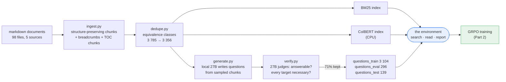
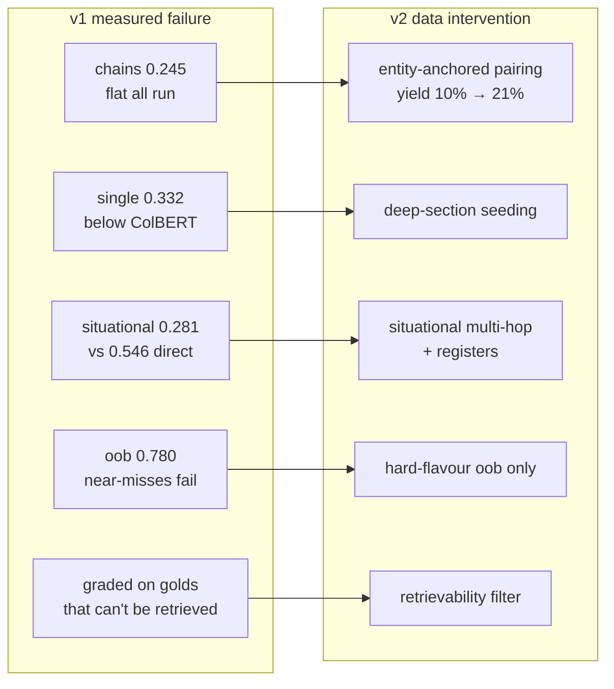

*Building an agentic retrieval model on one RTX 4090. This is the first of
three posts:*

- **Part 1 — The data** (you are here): corpus, chunking, synthetic questions,
  verification, and the failure→data map that decided everything.
- [Part 2 — The environment and the RL](/blog/agent-rl/part-2-rl/): three tools, tokens-in/
  tokens-out, the reward, and the GRPO loop in full — including how mine
  differs from textbook GRPO.
- [Part 3 — Results](/blog/agent-rl/part-3-results/): two runs, and a zero-shot jump from
  insurance policies to programming books.
- [Glossary](#glossary) — every term used here, defined plainly.
- [References](#references).

---

## Why this project exists

Give a person a question and a pile of documents and watch what they actually
do. They skim, notice the words the documents use, search again with better
words, follow a pointer from one page to another, and stop when they have
enough. Retrieval is a *process*.

One-shot RAG — embed, rank, truncate — collapses that process, and fails
exactly where the process would have saved it:

- **Vocabulary gaps.** A caller says *"a rock cracked my windscreen on the
  N1."* The document says *"glass excess, Annexure C."* No shared content
  words.
- **Multi-hop.** *"What excess applies to the device that comes with the
  night-driving benefit?"* The device's name is in one document, its excess in
  another. The second query doesn't exist until the first result is read.
- **Absence.** Ask something the corpus doesn't cover and a top-*k* retriever
  returns *k* documents anyway. It cannot say "not here."

So: train a small model to *search* — reformulate, chain, fan out, abstain.
The whole project rests on two decisions that make "did it learn searching?" a
question you can actually answer:

1. **The model outputs document IDs, never prose.** It cannot bluff from
   parametric knowledge. The only way to score is to find things.
2. **Those IDs are randomised per episode.** It cannot memorise them either.

Which means the model can only be as good as the data teaches it to be — and
that's why the data comes first.

---

## The pipeline, end to end


***Figure 1.*** *The data pipeline. Every arrow is a separate process that reads files and writes files to `artifacts/`; any stage can be deleted and re-run without rebuilding the ones before it.*

<details markdown="1"><summary>same diagram as editable Mermaid / draw.io source</summary>



Editable source: [`diagrams.drawio`](/assets/agent-rl/diagrams.drawio) (page *data-pipeline*).

</details>

Figure 1 traces it end to end: every arrow is a separate process writing a file to `artifacts/`. Delete any
stage's output, re-run only that stage, and everything downstream still works
— which matters because RL runs fail at hour nine and you do not want to
rebuild an index to resume.

---

## 0. What "the data" actually is — exactly

### 0.1 Where the documents come from

**The source is public marketing and policy documentation from five South
African insurers**, downloaded as PDFs and converted to markdown. Nothing was
scraped from a private system; these are the brochures, plan guides, benefit
annexures and full policy wordings that each insurer publishes for customers
and brokers. Two conversion routes were used: a straightforward PDF→markdown
export for the Discovery set, and MinerU VLM extraction for the rest (which is
also where the heading-structure damage in §1 came from).

**Exact composition of the training corpus — 98 documents, 3 785 chunks:**

| source label | documents | chunks | what they are |
|---|---|---|---|
| Discovery Insure | 52 | 781 | benefit one-pagers, plan brochures, annexures (excess, benefit limits), programme guides |
| Hollard | 23 | 829 | Premier/Easy product guides, cover sections, comparison and limits sheets |
| Santam | 10 | 988 | full personal policy wordings (2019/2024), addenda, annexures, SOS value-added services |
| Old Mutual | 9 | 997 | iWyze and Insure AllSure/MotorSure policy wordings, comparison documents |
| OUTsurance | 4 | 190 | personal policy wording (car/home), essential wording, benefits/rewards |
| **total** | **98** | **3 785** | of which 98 are synthetic TOC chunks (one per document) |


***Figure 2.*** *Corpus and question composition. The corpus is deliberately imbalanced (note the log scale: Old Mutual contributes 997 chunks from 9 documents, OUTsurance 190 from 4), but questions come out balanced because generation samples the insurer uniformly first.*

Document sizes span **159 to 72 038 tokens** (median 2 125) — deliberately
mixed, because "orient inside a long document" is a skill I want trained.
Body chunks: median 101 tokens, p95 480 (the chunker splits on structure
first, capping at 480 tokens with 60 overlap).

Note the deliberate imbalance in Figure 2: Old Mutual and Santam contribute ~2 000 chunks
from 19 documents (huge policy wordings), OUTsurance 190 from 4. Question
generation corrects for this by sampling the *insurer* uniformly and then a
chunk within it — which is why the question counts below are balanced even
though the corpus is not.

### 0.2 The transfer corpus (evaluation only, never trained on)

To test whether the agent learned *searching* rather than insurance, a second
corpus from a completely different domain, cloned from public GitHub repos:

| source label | documents | chunks |
|---|---|---|
| The Rust Programming Language (`rust-lang/book`) | 112 | ~900 |
| *You Don't Know JS* — 6 books (`getify/You-Dont-Know-JS`) | 27 | ~790 |
| **total** | **139** | **1 692** (139 TOC) |

Same pipeline, separate artifact namespace. The model never sees it during
training; it exists solely for the zero-shot test in
[Part 3](/blog/agent-rl/part-3-results/).

### 0.3 What the questions are, exactly

The questions are **synthetic and locally generated** — a Qwen3.8-27B running
in Ollama on the same machine writes them from sampled chunks, and the same
model judges them. No human-written questions, no public QA dataset, no
network calls.

**Training set — 3 104 verified questions:**

| dimension | breakdown |
|---|---|
| pattern | single 1 510 · conjunctive 531 · **chain 314** · oob (unanswerable) 749 |
| hops | 1-hop 2 259 · 2-hop 830 · 3-hop 15 |
| phrasing | direct 1 833 · **situational** (incident-voiced, emotional registers) 1 271 |
| source insurer | Santam 507 · OUTsurance 498 · Hollard 478 · Old Mutual 464 · Discovery 408 · (oob: no source) 749 |
| extra tags | 235 cross-insurer comparisons · 253 competitor mentions · 198 deep-document · 1 253 with expanded alt-targets |

**Evaluation sets, all generated by *different prompt pipelines* from the
training generator** (so the model must generalise across question styles, not
fit one generator):

| set | questions | purpose |
|---|---|---|
| `questions_eval` | 296 | main held-out (single 162 · conj 49 · chain 22 · oob 63) |
| `questions_test` | 139 | third generator, fresh seed — never used for any decision |
| `transfer/questions_eval` | 62 | Rust/JS corpus, zero-shot only (single 13 · conj 12 · chain 10 · oob 27) |

**What a single training example contains.** Not an (input, output) pair — the
model is never shown a correct trajectory. It is a question plus its *verified
gold document set*:

```json
{
  "qid": "3f9a2c1b77",
  "question": "I just got back from the police station. My home was broken into
               last night and my daughter's heirlooms were stolen. I'm barely
               holding it together... Do you guys have someone who can handle
               the immediate aftermath for me?",
  "targets": ["2023-trauma-concierge-process/e0004"],
  "alt_targets": ["2023-trauma-concierge-process/e0011"],
  "pattern": "single", "n_hops": 1,
  "phrasing": "situational",
  "register": "distressed after something traumatic",
  "insurer": "Discovery Insure",
  "seed_doc": "8c21f0",
  "solve_rate": 0.375
}
```

The agent sees **only the `question` string**. Everything else is scoring
metadata: `targets` computes the reward, the tags slice the evaluation, and
`solve_rate` decides whether the question is sampled during training at all.

### 0.4 What the agent actually does with this data


***Figure 3.*** *The agent and its three tools. `search` returns cheap excerpts, `read` costs a turn, `report` ends the episode and triggers the reward. Both search and read take *lists* — that is the entire parallelism mechanism — and the document ids the agent sees are randomised every episode.*

The data above only makes sense alongside what the agent is allowed to do with
it. It gets **three tools** and nothing else — Figure 3 shows the whole surface
([Part 2](/blog/agent-rl/part-2-rl/) has the full mechanics):

```python
search(queries: list[str], mode="hybrid", k=10) -> excerpts   # ~200 chars + breadcrumb each
read(doc_ids: list[str])                        -> full text
report(doc_ids: list[str])                      # ordered answer; ends the episode
```

`search` is backed by the two indexes built from the corpus — BM25 and
ColBERT — selected by `mode` (`lexical | semantic | hybrid`). Both `search`
and `read` take **lists**, which is the only parallelism mechanism in the
system. `report([])` is the abstention. The document IDs in every result are
randomised per episode.

Here is a **real, unedited episode** from training step 152 (a chain question,
final reward 1.10, three turns — observations truncated for space):

```text
USER  According to the policy, the premium discount for referring new clients
      does not affect the calculation of which specific reward feature?
      How is that feature forfeited?

ASSISTANT
<tool_call>
{"name": "search", "arguments": {"queries": [
   "premium discount referring new clients reward forfeited",
   "referring new clients premium discount reward feature forfeiture",
   "new client referral premium discount how reward is forfeited"],
 "mode": "hybrid", "k": 10}}
</tool_call>

TOOL  [search] "premium discount referring new clients reward forfeited" (mode=hybrid):
        id=ddvz | OUTsurance: 2026-personal-policy-wording-car-home > Premium Discounts | You may at any time provide us with the details of persons...
        id=dprf | OUTsurance: 2026-essential-policy-wording > Premium Discounts | You may at any time provide us with the details of persons...
        id=dxfh | 2023-hollard-premier-training-product-guide > No-claim reward | A no-claim reward (NCR) is my way of rewarding clients by...
        id=dzix | Discovery Insure: 2024 Gap in Cover > Vitality Drive rewards | All Vitality Drive benefits and rewards will be suspended...
        ... (30 candidates across the three queries)

ASSISTANT
<tool_call>
{"name": "read", "arguments": {"doc_ids": ["ddvz", "dprf", "dxfh", "dzix"]}}
</tool_call>

TOOL  [read] id=ddvz | OUTsurance: 2026-personal-policy-wording-car-home > Premium Discounts
        ...Please note that this discounted months' premium will not have an
        effect in the calculation of your OUTbonus and the OUTbonus will be
        calculated as if...

ASSISTANT
<tool_call>
{"name": "report", "arguments": {"doc_ids": ["ddvz", "dprf"]}}
</tool_call>
```

Three things in that trace are the entire point of the project, and all three
are consequences of the data design rather than of prompting:

- **It fanned out.** Three reformulations of the question in *one* call — the
  question never says "OUTbonus", so the agent had to guess vocabulary from
  several angles at once. That behaviour is trained by turn cost, not
  instructed.
- **It triaged then read.** Thirty excerpts scanned, four documents actually
  read. That is the excerpt/read split doing its job.
- **It committed to two documents.** Not ten. The two OUTsurance wordings that
  contain the clause; the plausible Hollard and Discovery "reward" chunks were
  read and dropped.

The IDs (`ddvz`, `dprf`…) are episode-local randoms. Tomorrow the same chunks
have different IDs, which is why the only way to produce that final line is to
have found them in this episode.

### 0.5 Replicating this on your own documents

Nothing above is insurance-specific. You supply **a folder of markdown files**
per source; the config takes `label: directory` pairs, so "insurer" is just a
label — it could be "publisher", "product", "team", "release". Requirements,
in order of importance:

1. **Real heading hierarchy** (`#`, `##`, `###`) — breadcrumbs and TOC chunks
   depend on it. PDF conversions are fine *if* the headings survived; check,
   because mine partly hadn't (§1).
2. **Enough documents that search is non-trivial.** ~3 800 chunks is
   comfortable; the 1 692-chunk transfer corpus also works. Below ~500 chunks
   every question is answerable in one search and there is nothing to learn.
3. **Some genuinely long documents**, or multi-hop and in-document navigation
   never arise.
4. **Topical overlap between sources**, if you want cross-source comparison
   questions (optional, but that's where fan-out training comes from).

You also need, once: a local instruct model to generate and judge questions
(I used Qwen3.8-27B via Ollama; any competent ~27B+ model works — it's a
one-time offline batch, and nothing touches the network at train time), and a
GPU for training (one RTX 4090).

**Pipeline outputs**, all JSONL in `artifacts/`, each stage a separate process:

| artifact | mine |
|---|---|
| `chunks.jsonl` — structure-preserving chunks + TOC chunks | 3 785 |
| `equiv_classes.jsonl` — near-duplicate classes | 3 356 |
| `bm25.idx`, `colbert.index/` — the two indexes | — |
| `questions_{train,eval,test}.jsonl` | 3 104 / 296 / 139 |
| `sft_traces.jsonl` — teacher trajectories, format-only | 400 |
| `solve_rates.jsonl` — per-question pass@8 difficulty | 3 104 |

**Rough wall-clock on my hardware:** ingest + both indexes ~10 min; question
generation + verification ~14 h of local 27B inference (~4 500 raw → 3 104
verified); teacher traces ~3 h; SFT 15 min; solve-rate pass ~5.5 h; GRPO 200
steps ~2 days.

---

## 1. Corpus: chunking that preserves structure

The corpus is 98 South African insurance documents from five insurers
(Discovery, Hollard, Santam, Old Mutual, OUTsurance) — brochures, policy
wordings, benefit annexures. Some are three pages; some are 157 000
characters.


***Figure 4.*** *From a document to retrievable chunks. Each chunk keeps its heading path as a breadcrumb, and every document also gets one synthetic table-of-contents chunk, indexed like any other.*

Chunks keep their place in the document tree:

```json
{
  "doc_id": "a7f3c9",
  "insurer": "Santam",
  "parent_id": "2024-santam-personal-policy-wording",
  "path": "2024-santam-personal-policy-wording/vehicle-theft/part-0",
  "title": "Vehicle theft and hijacking",
  "breadcrumb": "Santam: Personal Policy Wording > Section 3 > Vehicle theft",
  "text": "...",
  "n_tokens": 480,
  "equiv_id": "2024-santam-personal-policy-wording/e0117"
}
```

Figure 4 shows what one document becomes. The `breadcrumb` is not decoration. It appears in every search result, so the
agent can reason about *where* it is in a document, not just what matched —
which is what makes "look at the contents page" a learnable move rather than a
prompt instruction.

I also emit one synthetic **TOC chunk per document**: the flattened heading
tree, no body text, indexed like anything else. The agent discovers on its own
that hitting a TOC early is a cheap way to orient in a 400-page policy
wording. (Watch its share of results: if TOC chunks take more than ~10% of
top-10 slots they pollute every search. In my corpus it was 6.2% lexical, 3.8% hybrid.)

### Two retrievers, one tool

- **BM25** (`bm25s`) — exact terms, numbers, citation strings, names.
- **ColBERT** (`mxbai-edge-colbert-v0-32m`, late interaction) — semantics,
  running on **CPU** at ~250 ms per query.

CPU for the retriever is a deliberate budget decision: the GPU's job is
rollouts, and a PLAID index competing with vLLM for 24 GB caused half of my
early crashes. A 32M-parameter encoder on CPU is not the bottleneck.

Both are exposed as *one* tool with a `mode` argument
(`lexical | semantic | hybrid`, fused by reciprocal rank). Letting the model
choose its retriever is itself a learnable skill and costs nothing in reward
design.

### The bug that only shows up if you look at your data

An extraction artifact in the OUTsurance documents had turned the company
*logo* ("OUT" / "SURANCE" split across lines) and page headers into markdown
headings, while the real section titles sat as plain body text. A stale
"SASRIA" heading therefore governed 124 chunks of unrelated content, and
`SASRIA > Optional cover` was the gold breadcrumb for three unrelated
questions.

The fix was generic (promote body lines that match the document's own
page-numbered contents list; drop empty logo-noise headings; hash chunk IDs
against original heading indices so repairs don't renumber survivors), and it
cut those breadcrumbs from 124 chunks to 4. Nobody would have found this in
the loss curve. It was found by reading gold documents for failed questions.

### Near-duplicates: the silent scoring bug

Long documents restate the same fact in the introduction, the body, and the
summary. If a target is a single chunk, an agent that reports the *equally
valid* duplicate is scored wrong — and on the dashboard that looks exactly
like over-reporting.

So chunks above 0.9 cosine similarity **within the same document** are merged
into an equivalence class (union-find over the pooled ColBERT embeddings):

```python
for idxs in by_parent.values():                # same document only
    sub = emb[idxs] @ emb[idxs].T
    for a in range(len(idxs)):
        for b in range(a + 1, len(idxs)):
            if sub[a, b] >= 0.90:
                dsu.union(idxs[a], idxs[b])
```

In my corpus: **3 785 chunks → 3 356 classes; 200 multi-member classes
covering 629 chunks; the largest holds 28 near-identical copies** of one
comparison table. Obfuscated IDs, reports, and NDCG all operate on classes
from then on, so the model is never punished for picking among duplicates it
cannot tell apart from an excerpt.

---

## 2. Questions: generate, then distrust

**Don't train on public multi-hop datasets.** Their target sets contain
unnecessary documents, and that trains over-reporting: the model learns to
report extra documents hoping to catch spurious targets. Synthetic questions
are better *only* because you can verify them.

Every question is generated by a local Qwen3.8-27B (via Ollama) with a
JSON-schema-constrained response, from a seed chunk sampled **uniformly across
insurers** — otherwise a 997-chunk insurer drowns a 187-chunk one:

```python
i = rng.choice(by_insurer[rng.choice(sorted(by_insurer))])   # insurer first, then chunk
```

### The taxonomy exists because the optimal policy differs


***Figure 5.*** *The four question types and the search policy each rewards. The tag is never rewarded — it exists so evaluation can check that the model switches modes.*

Figure 5 lays out the four types and the trajectory each one rewards.

| pattern | shape | correct policy |
|---|---|---|
| `single` | one chunk answers it | one search, report |
| `conjunctive` | two independent facts, both named in the question | **one turn, fan out** |
| `chain` | hop-2's search terms exist only in hop-1's result | **genuinely sequential** |
| `oob` | verified unanswerable from this corpus | search, then `report([])` |

The tag is **never rewarded**. It exists so evaluation can prove the model
*switches* modes instead of always fanning out or always crawling.

### Verification is where the leverage is


***Figure 6.*** *Verification discards 31% of generated questions. The arithmetic reconciles exactly: 4 498 − 704 − 563 − 57 − 72 = 3 102 verified.*

Each candidate goes to the judge with its targets:

```
1. answerable — can the question be answered completely using ONLY these passages?
2. necessary  — for EACH passage: would removing it make the answer incomplete,
                OR is it required to work out what the question refers to?
```

Unnecessary targets are dropped. Questions lose their seed, empty out, or fail
answerability and are discarded. A chain whose hop-1 document turns out to be
decorative gets **retagged as single** — which is how I learned my chains
were mostly fake (below).

Out-of-bounds questions get a different, retrieval-grounded check: run the
question through hybrid search, hand the judge the top-5 chunks, and reject
the question if they could answer it even partially. "Unanswerable" is a
measured property, not the generator's opinion.

Keep rates: **v1 62%, v2 71%**. Figure 6 breaks the v2 rejections down by reason.

### Making the questions sound like real callers

Two axes, because production traffic is not tidy.

**Situational phrasing (~32%).** The generator must describe an incident and is
*forbidden* from using the documents' policy vocabulary — manufacturing the
vocabulary gap on purpose. **Emotional registers** — calm, frantic, angry,
rambling/oversharing, post-trauma — because a claims line sounds like this:

> *"I just got back from the police station. My home was broken into last
> night and my daughter's heirlooms were stolen. I'm barely holding it
> together, shaking so bad I can't think. Do you guys have someone who can
> handle the immediate aftermath for me? I don't want to deal with all the
> insurance paperwork myself right now."*

Gold: the trauma-concierge document. The words "trauma" and "concierge" appear
nowhere in the question. That gap is the whole training signal.

**Out-of-bounds flavours (8 of them):** uncovered insurance topics, general
trivia, famous people, bad-faith requests ("how do I get away with
exaggerating a claim"), personal advice, chitchat, situational near-misses,
and questions about insurers I hold no documents for (MiWay, King Price,
Naked…). All get the same correct answer: search, find nothing, report empty.
The near-misses and uncovered-insurer flavours are the hard ones — they're
the two that failed in v1.

**Cross-insurer comparisons.** Half of conjunctive questions force partners
from *different* insurers on the same topic ("Discovery vs Hollard on power
surge"), ~25% of those three-way. Comparisons are conjunctive by nature: each
insurer's fact is independently searchable, so they're pure fan-out material.

---

## 3. The failure → data map

v1 trained fine and beat every baseline. Its slice table did the talking:

| slice | v1 NDCG | diagnosis |
|---|---|---|
| chain | **0.245** | flat all run, *falling* in the phase built to help it |
| situational | 0.281 | vs 0.546 on direct phrasing |
| single | 0.332 | below ColBERT's 0.404; misses cluster in long documents |
| oob | 0.780 | down from SFT's 0.923 — failures all plausible near-misses |

Then I read the 52 failed questions one by one, and the causes turned out to
be *properties of the data*, not of the optimiser.



### (a) Chains were mostly not chains

Partners were chosen by embedding nearest-neighbour. On a book-like corpus the
nearest neighbour of a chunk is almost always **the adjacent paragraph of the
same section** — so a "2-hop" question was a 1-hop question with a longer
answer. The judge rejected them correctly (10% survived), and many survivors
had bridges that weren't load-bearing.

**Fix — entity-anchored pairing:**

1. Ask the 27B to name one distinctive entity introduced in chunk A ("a
   benefit, device, plan tier, or defined term").
2. Find chunk B by **lexically searching that entity** in a *different*
   document.
3. Require the question to withhold the entity, so B is unreachable without
   reading A. (Post-generation leak check enforces it.)

Now the bridge is load-bearing *by construction*, and the numbers moved:

| pairing | verified chain yield | hop profile |
|---|---|---|
| embedding NN (v1) | ~10% | dominated by same-section |
| **entity-anchored (v2)** | **21%** (250 / 1 200) | **100% cross-document** |

I also added the constraints the redline demanded of any pairing: drop
candidates sharing the seed's section path or equivalence class, and require
≥50% of multi-hop questions to cross documents. Final hop-distance histogram:
**64% cross-insurer, 34% cross-document, 1.6% same-document.**

### (b) Deep documents

Uniform seeding under-sampled deep sections of 150k-character policy wordings,
and single-hop misses clustered exactly there — often finding the right topic
in the **wrong insurer's parallel section**. Fix: a batch seeded only from
sections deeper than index 5 in the largest documents, tagged `deep_doc`.

### (c) Hard abstention

v1's oob set was mostly easy flavours; by v2 the model solved those and the
remaining failures were all near-misses. Fix: a top-up weighted to the two
hard flavours only.

### (d) Unreachable golds

Several v1 questions had target documents that **could not be retrieved from
the question text at all** — the model was graded on impossible fetches. Fix:
a retrievability filter at generation time — every target class must appear in
hybrid top-50 for the question's own text, or the question is dropped and
logged.

### (e) The hedging that wasn't

Some "over-reporting" was a scoring artifact: in one case the agent's top
reported document had the *identical breadcrumb* as gold — a different
`part-N` of the same section. That's what equivalence classes (Part 1, §1) and
verify-time class expansion fix. Extras counted after that are true strangers.

---

## 4. What the data looked like in the end

**v2 training set: 3 104 verified questions**

| pattern | count | | axis | count |
|---|---|---|---|---|
| single | 1 510 | | situational phrasing | 1 069 (39%) |
| oob | 749 | | alt-target classes | 1 253 |
| conjunctive | 531 | | cross-insurer comparisons | 235 |
| **chain** | **314** (250 entity-anchored) | | competitor mentions | 253 |
| | | | deep-doc | 198 |

Insurer balance: Santam 448, OUTsurance 410, Hollard 399, Old Mutual 398,
Discovery 312 — near-uniform despite corpus shares ranging 5×.

Plus **296 held-out eval** questions (different prompt pipeline), **139 unseen
test** questions (third generator, fresh seed), and **62 transfer questions**
over a completely different corpus — Rust and JavaScript books — which never
appear in training and exist only to answer the question in Part 3.

---

## 5. The one piece of math that changes what you generate

Everything above is judgement about documents. This part isn't — it's forced.

In GRPO — *Group Relative Policy Optimization*, the RL algorithm I use: it
scores several attempts at the same question and uses their **average as the
baseline**, instead of training a separate value network to predict it
([Part 2](/blog/agent-rl/part-2-rl/), [glossary](#glossary)) — a question is trained on by
sampling a group of $$G$$ rollouts and centring their rewards on the group
mean,
$$A_i = R_i - \bar{R}$$. So if all $$G$$ rollouts score the same — all fail,
or all succeed — then every $$A_i = 0$$ and **the group contributes exactly
zero gradient** while costing a full step of rollout compute. For a roughly
binary outcome with success probability $$p$$, the reward variance driving the
gradient is $$p(1-p)$$: maximal near $$p = 0.5$$, vanishing at both ends.

Which means a question's *difficulty for the current policy* decides whether
it's worth sampling at all — and that is a property you can measure before
training rather than discover by wasting steps on it. After SFT I ran pass@8
over every training question and kept the band:


***Figure 7.*** *Solve rate per question, measured as pass@8 with the SFT policy. Only the 1 380 questions in the middle band can produce a gradient; the 915 all-zero and 809 all-perfect questions are never sampled during training.*

| solve rate (pass@8 with the SFT policy) | questions | share |
|---|---|---|
| < 0.15 — too hard, all-zero groups | 915 | 29% |
| **0.15 – 0.85 — learnable** | **1 380** | **44%** |
| > 0.85 — too easy, all-perfect groups | 809 | 26% |

GRPO samples only from the middle band (the green bars in Figure 7),
re-measured as the policy improves.
More than half of v1's rollout budget had been going to groups that
mathematically could not teach anything. This is [DAPO]'s dynamic sampling,
done offline so it costs no rollouts during training.

The other place data and math meet is the definition of a chain question, and
it fits in one line: the second target must be **unreachable from the question
text but reachable once you have read the first**. Entity-anchored pairing
enforces exactly that (find B by searching for A's entity; forbid the question
from naming it), which is why its questions survive verification twice as
often as embedding-nearest pairs — those mostly return the adjacent paragraph,
where the "second hop" was already reachable from the question.

---

**Next:** [Part 2 — The environment and the RL](/blog/agent-rl/part-2-rl/) — the three-tool
surface, the token buffer rule that keeps multi-turn RL from collapsing, the
reward equations, and the GRPO update in full, including a line-by-line diff
against textbook GRPO.

*Sources for this part: [SID-1] (verified synthetic questions over public
multi-hop sets, ID obfuscation, excerpt/read hierarchy), [DAPO] (zero-variance
group filtering), [NDCG], [ColBERT]/[PLAID]/[pylate]/[mxbai] (retrieval stack),
[bm25s]. Full list in [references.md](#references).*


---

## Glossary {#glossary}

<details markdown="1">
<summary>Plain definitions of every term used in the series. Click to expand.</summary>


### Retrieval and evaluation

**Corpus / chunk / document.** The *corpus* is the whole collection. A
*document* is one source file. A *chunk* is the retrievable unit — one section
(or part of a section) of a document, ~100–480 tokens here. The agent searches
and reports chunks, not whole documents.

**BM25 (lexical search).** The classic keyword-scoring function: a document
scores highly when it contains the query's rare words often, adjusted for
document length. It knows nothing about meaning — "car" and "vehicle" are
unrelated to it — which makes it excellent at exact names, numbers and
citations, and useless across a vocabulary gap.

**Embedding / dense retrieval.** Encode query and document into vectors and
rank by cosine similarity, so "vehicle" and "car" land near each other.
Standard dense retrieval squashes a whole passage into *one* vector.

**Late interaction / ColBERT.** A middle ground: encode *every token* into a
small vector, then score a query-document pair by, for each query token, taking
its best match among the document's token vectors and summing (called MaxSim).
Keeps word-level detail that a single vector loses, at the cost of storing many
vectors per chunk. The one I use is a 32M-parameter model running on CPU.

**PLAID.** The index structure that makes late-interaction search fast enough
to use (clustering + quantisation over all those token vectors).

**Hybrid search / RRF.** Running both retrievers and fusing their ranked lists.
*Reciprocal rank fusion* scores each document by $$\sum_r 1/(k + \text{rank}_r)$$
over the lists it appears in (I use $$k=60$$) — rank-based, so it needs no
score calibration between systems.

**Top-*k* / one-shot retrieval.** The baseline everything is compared against:
embed the question once, return the *k* best chunks, stop. No follow-up
queries, no reading, no way to abstain.

**Precision / recall.** Of the documents you returned, what fraction were
right (*precision*); of the right documents, what fraction did you return
(*recall*). A top-10 retriever has poor precision by construction — it always
returns ten things.

**DCG, IDCG, NDCG.** The metric this project optimises.
*Discounted Cumulative Gain* sums the relevance of returned items, discounting
by position, because a right answer at rank 1 is worth more than at rank 8:

$$\mathrm{DCG} = \sum_{i} \frac{g_i}{\log_2(i+1)}, \qquad g_i \in \{0, 1\}$$

*Ideal DCG* is the same sum for a perfect ordering (all targets first):

$$\mathrm{IDCG} = \sum_{i=1}^{|\text{targets}|} \frac{1}{\log_2(i+1)}$$

*Normalised DCG* is the ratio $$\mathrm{NDCG} = \mathrm{DCG}/\mathrm{IDCG}$$,
so 1.0 means "found everything, in the best order" and 0 means "found
nothing." Its logarithmic discount is why padding a report with extra
documents helps so little: rank 8 is worth $$1/\log_2 9 \approx 0.32$$ of
rank 1.

**pass@k.** Sample *k* independent attempts at a question; pass@k is the
fraction that succeed. Used here to measure how hard each question is for the
current policy (my *solve rate*).

**Zero-shot.** Evaluating a trained model on something it was never trained on
— here, a whole different corpus (programming books instead of insurance
documents) with no additional training.

---

### Reinforcement learning

**Policy ($$\pi_\theta$$).** The model itself, viewed as a thing that takes a
state and produces an action distribution. Here the state is the token buffer
so far and the action is the next token.

**Rollout / trajectory / episode.** One complete run of the agent on one
question: search → observation → read → observation → report. In this project
a trajectory is literally one array of token ids plus a mask saying which of
them the model produced.

**Turn.** One assistant message inside an episode (which may contain several
tool calls). Episodes here run 2–4 turns.

**Reward ($$R$$).** A single number scoring the finished episode — for me,
mostly NDCG over the reported documents, plus small format/budget/length
terms. *Sparse* because it arrives only at the end, not per token.

**Return / credit assignment.** The problem of deciding which of the many
decisions in an episode deserve the reward. Multi-turn agents make it hard: a
good first query may only pay off three turns later.

**Policy gradient.** The basic RL update for language models: increase the log
probability of tokens that led to better-than-expected outcomes, decrease it
for worse. Formally, ascend
$$\mathbb{E}[A \cdot \nabla_\theta \log \pi_\theta(a\mid s)]$$.

**Baseline and advantage ($$A$$).** Raw rewards are noisy, so you subtract a
reference value: the *advantage* is how much better this attempt was than
expected. Positive advantage → make those tokens more likely; negative →
less. PPO learns a value network to predict the baseline; GRPO does not.

**Group ($$G$$).** In GRPO, the several attempts at the *same* question that
are compared against each other (8 here).

**GRPO — Group Relative Policy Optimization.** The algorithm this project
uses. Instead of training a value network to estimate "expected reward from
this state", sample $$G$$ attempts at the same question and use their **mean
reward as the baseline**:

$$A_i \;=\; R_i - \frac{1}{G}\sum_{j=1}^{G} R_j$$

Cheaper (no critic to train or store), well-suited to problems where you can
sample many attempts, and the reason a 1.7B policy plus a serving engine fits
on one 24 GB card. Introduced in DeepSeekMath; popularised by DeepSeek-R1.
[Part 2 §6](/blog/agent-rl/part-2-rl/) covers how my version differs from the standard one.

**PPO — Proximal Policy Optimization.** The predecessor GRPO borrows its loss
shape from. It reuses a batch of rollouts for several gradient steps and, to
stop the policy moving too far, *clips* the ratio
$$r = \pi_\theta / \pi_{\theta_{\text{old}}}$$ between the new and old policies.
I take exactly one step per batch, so that ratio is always 1 and the clipping
does nothing — which is why my objective drops it.

**On-policy vs off-policy.** *On-policy* means you train on data the current
model just generated. If the sampler and the trainer disagree even slightly
(different precision, different kernels), you are silently a bit off-policy —
which is why I log the sampler/trainer logprob gap.

**KL divergence / KL penalty ($$\beta$$).** A measure of how far one
distribution has drifted from another. RLHF setups often add
$$-\beta\,\mathrm{KL}[\pi_\theta \Vert \pi_{\text{ref}}]$$ to keep the policy
near its starting point. I set $$\beta = 0$$.

**Zero-variance group.** A group where every attempt scores the same, so every
advantage is 0 and the group produces no gradient at all — pure wasted
compute. Avoiding these is what the solve-rate band is for.

**Logprob (log probability).** $$\log \pi_\theta(\text{token})$$ — the number
the policy gradient actually manipulates. Measured in *nats*; a gap of 0.011
nats between two computations of the same token means they agree to about 1%.

**Temperature / top-p.** Sampling controls. *Temperature* 1.0 means sample
from the model's raw distribution (more exploration, needed for RL); *top-p*
0.95 restricts sampling to the smallest set of tokens covering 95% of the
probability mass, cutting the pathological tail.

**Importance sampling (truncated IS).** A correction applied when the data was
generated by a slightly different policy than the one being updated — weight
each token by the ratio of the two probabilities, clipped for stability. My
fallback if the logprob gap ever grows; never needed.

---

### Training, adapters and serving

**Base model / instruct model.** The pretrained network (Qwen3-1.7B here) and
its instruction-tuned variant. "1.7B" = 1.7 billion parameters.

**SFT — supervised fine-tuning.** Training on demonstrations: given this
prompt, produce these exact tokens. Cheap and stable, but it can only imitate.
I use 400 traces of it purely to teach *tool syntax*, then stop.

**Teacher / trace.** A larger model (a local 27B) run through the same
environment to produce example episodes for SFT. A *trace* is one such
episode.

**RL vs SFT, in one line.** SFT teaches the model to copy a good trajectory;
RL teaches it to *find* one, by rewarding outcomes of its own attempts.

**LoRA — Low-Rank Adaptation.** Instead of updating all weights, freeze them
and learn a small low-rank correction $$\Delta W = BA$$ for chosen layers
(rank 32 here, ~1% of parameters). Makes training fit in memory, and the
result is a small adapter file you can swap in and out.

**Adapter hot-swap.** Because LoRA is a separate file, the serving engine can
load the freshly-updated adapter after each training step without reloading
the base model.

**Epoch / step / batch.** A *step* here is one full GRPO iteration: sample
rollouts for 4 questions × 8 attempts, compute rewards, take one gradient
update. 200 steps is the whole run.

**Gradient checkpointing.** A memory trick: discard intermediate activations
during the forward pass and recompute them during the backward pass. Trades
compute for memory; silently disabled if the model is left in eval mode (a bug
that cost me a day).

**KV cache.** The stored attention keys/values for the tokens generated so
far, so each new token doesn't reprocess the whole context. It is the dominant
memory cost during rollouts, and it is why long multi-turn episodes are
expensive.

**vLLM / colocation / sleep-wake.** vLLM is a fast serving engine (paged KV
cache, batching). *Colocation* means it shares the one GPU with the trainer;
I put it to *sleep* during the backward pass and *wake* it afterwards with
the new adapter.

**FP8 / bf16.** Numeric formats. `bf16` (16-bit) is what I train and serve
in; `fp8` (8-bit) halves the weight memory again and is the next step for a 4B
model.

**Context window / length schedule.** The maximum number of tokens an episode
may occupy (8k → 16k → 24k across training). Raising it late is a compute
allocation choice: cheap short episodes early, expensive long ones once the
policy can use them.

---

### Terms specific to this project

**Tool call.** A JSON block the model emits (`search`, `read`, `report`) that
the environment parses and executes, returning an observation.

**Fan-out.** Putting several queries in one `search` call rather than taking
several turns. Measured as *tool calls per turn*.

**Excerpt vs read.** `search` returns ~200-character excerpts; full text costs
a separate `read` call. Lets the agent triage many candidates cheaply.

**Breadcrumb.** The heading path of a chunk ("Santam: Personal Policy Wording
> Section 3 > Vehicle theft"), shown in every search result so the agent knows
*where* a hit sits in a document.

**TOC chunk.** A synthetic chunk per document containing its flattened heading
tree, indexed like any other chunk — a cheap way for the agent to orient in a
long document.

**ID obfuscation.** Remapping real chunk IDs to per-episode random tokens, so
the model cannot memorise "the answer is chunk a7f3c9" across training epochs.

**Equivalence class.** A set of near-duplicate chunks within a document
(cosine ≥ 0.9) treated as one unit for IDs, reporting and scoring, so
reporting an equally valid duplicate is not punished.

**Abstention / out-of-bounds (oob).** A question verified to be unanswerable
from the corpus; the correct behaviour is to search, find nothing, and
`report([])` — the empty report.

**Pattern tags: single / conjunctive / chain.** Question types by the search
policy they reward — one lookup; two independent facts (fan out in one turn);
a dependency where hop 2's search terms only exist in hop 1's result (search
sequentially). Never rewarded directly; used to check the model *switches*
modes.

**Situational phrasing / register.** Questions written as an incident in the
caller's own words ("a rock cracked my windscreen") rather than in document
vocabulary, optionally in an emotional register (frantic, angry, rambling,
post-trauma).

**Solve rate / band.** Per-question pass@8 with the current policy; training
samples only questions in the $$[0.15, 0.85]$$ band, where groups actually
produce gradient.

**Over-report ratio.** $$\text{mean}(|\text{reported}|)/\text{mean}(|\text{targets}|)$$
— the dashboard signal for padding reports. Sustained climb past 1.5 is a
kill-criterion.

**Token-in/token-out (TITO).** Feeding the model token *ids* and appending the
ids it returns verbatim, never re-rendering the conversation through a chat
template. The discipline that keeps multi-turn RL from collapsing.


</details>


---

## References {#references}

<details markdown="1">
<summary>Papers, reports and tools cited across the series. Click to expand.</summary>

### The report this project is built on

- **[SID-1]** *SID-1 Technical Report*, SID AI, Dec 2025.
  <https://www.sid.ai/research/sid-1-technical-report>
  The source of: report-document-IDs-not-answers, hierarchical
  excerpt/read retrieval, per-episode ID obfuscation, strict token-in/token-out
  rollouts, keeping the length bias in the advantage, length scheduling, and
  the "don't train on public multi-hop datasets" argument. Almost every
  non-obvious decision in Parts 1–2 traces here.
- **[TP]** turbopuffer, *Training SID-1 to beat GPT-5 at search*, May 2026.
  <https://turbopuffer.com/blog/reinforcement-learning-sid-ai>

### RL algorithms

- **[GRPO]** Shao et al., *DeepSeekMath: Pushing the Limits of Mathematical
  Reasoning in Open Language Models*, 2024. arXiv:2402.03300 — introduces
  Group Relative Policy Optimization: group-sampled baselines, no value
  network.
- **[R1]** DeepSeek-AI, *DeepSeek-R1: Incentivizing Reasoning Capability in
  LLMs via Reinforcement Learning*, 2025. arXiv:2501.12948.
- **[PPO]** Schulman et al., *Proximal Policy Optimization Algorithms*, 2017.
  arXiv:1707.06347 — the clipped surrogate GRPO inherits.
- **[DrGRPO]** Liu et al., *Understanding R1-Zero-Like Training: A Critical
  Perspective*, 2025 — proposes removing length/std normalisation biases.
  I deliberately **do not** adopt the length debiasing; see Part 2 §5.2 and
  [SID-1].
- **[DAPO]** Yu et al., *DAPO: An Open-Source LLM Reinforcement Learning System
  at Scale*, Mar 2025 — dynamic sampling that discards zero-variance groups.
  My solve-rate band is the offline version of this idea.
- **[TITO]** Hugging Face, *Agentic RL: Token-In, Token-Out Done Right*, May
  2026. <https://huggingface.co/blog/huggingface/tito> — the delta-append
  rollout loop and the chat-template prefix-preservation problem.
- **[IS]** Yao et al., *Your Efficient RL Framework Secretly Brings You
  Off-Policy RL Training*, 2025.
  <https://fengyao.notion.site/off-policy-rl> — inference/trainer logprob
  mismatch and truncated importance sampling; the reason I log the gap.

### Privileged / self-distillation (planned stage, not yet run)

- **[PBSD]** *Privileged Bayesian Self-Distillation for Long-Horizon Credit
  Assignment*, Jun 2026. arXiv:2606.09348 — advantage reweighting by an
  evidence score instead of a KL target.
- **[SDAR]** *Self-Distilled Agentic RL*, May 2026. arXiv:2605.15155.
- **[SkillSD]** *Skill-Conditioned Self-Distillation for Multi-turn LLM
  Agents*, Apr 2026. arXiv:2604.10674.
- **[OPID]** *On-Policy Skill Distillation for Agentic RL*, Jun 2026.
  arXiv:2606.26790.
- **[PathRouter]** *Gold-evidence teacher for agentic retrieval*, Jun 2026.
  arXiv:2606.16409 — masks KL on answer tokens; the reason my OPSD spec masks
  KL on `report` tokens.

### Retrieval

- **[NDCG]** Järvelin & Kekäläinen, *Cumulated Gain-Based Evaluation of IR
  Techniques*, ACM TOIS 20(4), 2002 — the metric my reward is built on.
- **[BM25]** Robertson & Zaragoza, *The Probabilistic Relevance Framework:
  BM25 and Beyond*, FnTIR 3(4), 2009.
- **[bm25s]** Lù, *BM25S: Orders of magnitude faster lexical search via
  eager sparse scoring*, 2024 — the lexical index I use.
- **[ColBERT]** Khattab & Zaharia, *ColBERT: Efficient and Effective Passage
  Search via Contextualized Late Interaction over BERT*, SIGIR 2020.
  arXiv:2004.12832.
- **[ColBERTv2]** Santhanam et al., *ColBERTv2: Effective and Efficient
  Retrieval via Lightweight Late Interaction*, NAACL 2022.
- **[PLAID]** Santhanam et al., *PLAID: An Efficient Engine for Late
  Interaction Retrieval*, CIKM 2022 — the index backend used via pylate.
- **[pylate]** LightOn, *PyLate* — late-interaction training/retrieval library.
  <https://github.com/lightonai/pylate>
- **[mxbai]** Mixedbread, *mxbai-edge-colbert-v0* (17M / 32M late-interaction
  retrievers for edge/CPU use), 2026 — my semantic retriever.
- **[RRF]** Cormack, Clarke & Buettcher, *Reciprocal Rank Fusion Outperforms
  Condorcet and Individual Rank Learning Methods*, SIGIR 2009 — hybrid mode
  and the 4× rollout fusion in Part 3.
- **[ARTE]** OpenPipe, *ART·E* — the email-search agent whose
  excerpt-then-read design SID-1 credits.

### Models, adapters, serving

- **[Qwen3]** Qwen Team, *Qwen3 Technical Report*, 2025 — the 1.7B policy and
  the 27B local generator/judge.
- **[LoRA]** Hu et al., *LoRA: Low-Rank Adaptation of Large Language Models*,
  2021. arXiv:2106.09685.
- **[LoRAReg]** Thinking Machines, *LoRA Without Regret*, Sep 2025 — LoRA's
  optimal LR sits ≈10× above full fine-tuning's, and low rank suffices for RL.
  The reason v2 moved from 1e-6 to 5e-6.
- **[vLLM]** Kwon et al., *Efficient Memory Management for Large Language Model
  Serving with PagedAttention*, SOSP 2023. arXiv:2309.06180.
- **[TRL]** Hugging Face TRL 1.9, Jul 2026 — multi-environment agentic GRPO;
  a supported alternative to the hand-rolled loop.
- **[Unsloth]** Unsloth, *FP8 Reinforcement Learning* docs — FP8 + weight
  sharing between vLLM and the trainer (planned for the 4B stage).


</details>

