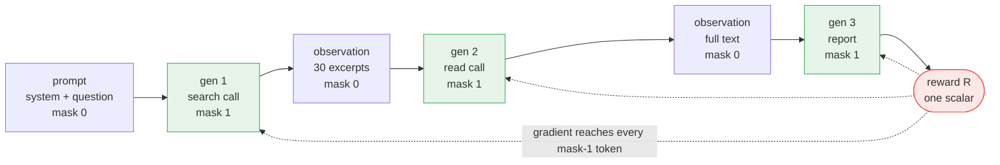
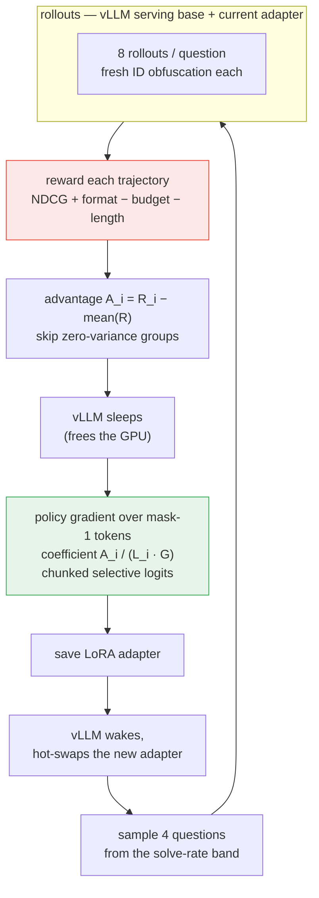

*Three of three posts on building an agentic retrieval model on one RTX 4090:*

- [Part 1 — The data](/blog/agent-rl/part-1-data/): corpus, questions, verification, the
  failure→data map.
- **Part 2 — The environment and the RL** (you are here): tools, the token
  buffer, the reward, the rollout formalism, and how my GRPO differs from the
  textbook version.
- [Glossary](#glossary) — every term used here, defined plainly.
- [References](#references).
- [Part 3 — Results](/blog/agent-rl/part-3-results/): two runs and the zero-shot transfer
  test.

---

## 1. The environment


***Figure 1.*** *The agent and its three tools. `search` returns cheap excerpts, `read` costs a turn, `report` ends the episode and triggers the reward. Both search and read take *lists* — that is the entire parallelism mechanism — and the document ids the agent sees are randomised every episode.*

*Editable source: [`diagrams.drawio`](/assets/agent-rl/diagrams.drawio), page* agent-and-tools*.*

Figure 1 is the whole system. Three tools, and the surface is frozen on purpose — every extra tool widens the
action space a 1.7B model has to explore under sparse reward.

```python
search(queries: list[str], mode: str = "hybrid", k: int = 10) -> list[Excerpt]
read(doc_ids: list[str])   -> list[FullChunk]
report(doc_ids: list[str])  # ordered, best first — terminates the episode
```

Four decisions inside those signatures do most of the work:

**Search returns excerpts, reading costs a call.** A result line is ~200
characters plus a breadcrumb, so the agent can triage forty candidates for the
context price of reading six.

**Both arguments are lists.** This is the *entire* parallelism mechanism.
There is no parallel API and no reward term for parallelism — batching queries
into one call is simply cheaper than spending another turn, so fan-out has to
emerge from the cost structure. (It did: 2.55 calls/turn, 3.16 on situational
questions.)

**`report([])` is legal** — the empty report is how the agent says "not in the
corpus." Scored, never prompted.

**IDs are obfuscated per episode.** Real chunk `a7f3c9` is `dqrx` in one
episode and `dmkw` in the next, seeded by `(question_id, rollout_idx)`:

```python
def fake_id(self, real_id):
    key = self._class_key(real_id)          # equivalence class, not chunk
    if key not in self._real_to_fake:
        fake = "d" + "".join(self._rng.choices(string.ascii_lowercase, k=3))
        ...
```

Two purposes. It blocks memorisation across epochs — there is no stable ID to
learn, so the only path to reward is finding the document *now*, which is what
makes 100 epochs over a small question set safe. And the seeding makes
episodes reproducible, so you can diff two runs when something breaks.

(The `"d" + 3 letters` alphabet is deliberate too: random mixed-case
alphanumerics fragment into unpredictable BPE pieces that a small model must
copy byte-exactly into `report`.)

The system prompt contains the tool signatures and nothing else — no domain
words, no worked examples, no strategy. Everything about *how* to search comes
from reward.

### A real episode

Step 152 of the v2 run, unedited apart from truncated observations (chain
question, reward 1.10, three turns). This is what the buffer in §2 actually
contains:

```text
<|im_start|>system
You are a document-search agent. Find the document chunks that answer the
user's question, then report their ids ordered most-relevant first. You cannot
answer from memory: ids only exist in search results.
[tool signatures]<|im_end|>
<|im_start|>user
According to the policy, the premium discount for referring new clients does
not affect the calculation of which specific reward feature? How is that
feature forfeited?<|im_end|>
<|im_start|>assistant                                    ← mask = 1 from here
<tool_call>
{"name": "search", "arguments": {"queries": [
   "premium discount referring new clients reward forfeited",
   "referring new clients premium discount reward feature forfeiture",
   "new client referral premium discount how reward is forfeited"],
 "mode": "hybrid", "k": 10}}
</tool_call><|im_end|>                                    ← mask = 0 from here
<|im_start|>user
<tool_response>
[search] "premium discount referring new clients reward forfeited" (mode=hybrid):
  id=ddvz | OUTsurance: 2026-personal-policy-wording-car-home > Premium Discounts | You may at any time provide us...
  id=dprf | OUTsurance: 2026-essential-policy-wording > Premium Discounts | You may at any time provide us...
  id=dxfh | 2023-hollard-premier-training-product-guide > No-claim reward | A no-claim reward (NCR) is my way...
  ... 30 candidates across three queries
</tool_response><|im_end|>
<|im_start|>assistant                                    ← mask = 1
<tool_call>
{"name": "read", "arguments": {"doc_ids": ["ddvz", "dprf", "dxfh", "dzix"]}}
</tool_call><|im_end|>
<|im_start|>user
<tool_response>
[read] id=ddvz | OUTsurance: ... > Premium Discounts
  ...this discounted months' premium will not have an effect in the calculation
  of your OUTbonus and the OUTbonus will be calculated as if...
</tool_response><|im_end|>
<|im_start|>assistant                                    ← mask = 1
<tool_call>
{"name": "report", "arguments": {"doc_ids": ["ddvz", "dprf"]}}
</tool_call><|im_end|>
```

Reward decomposition for this episode: NDCG 1.0 (both gold classes reported,
in order), format 1.0, budget penalty 0 (3 turns and 4 reads against a 2-hop
allowance), length penalty ≈0 → **R ≈ 1.10**.

The gradient from that scalar reaches every `mask = 1` token — including the
three query strings in turn 1, which is where the actual retrieval decision
was made. That is the credit assignment a supervised objective cannot express.


### What "multi-turn" means here — and what it does not

The episodes are multi-turn in the **agent ↔ environment** sense: the model
acts, sees a tool result, acts again, and the reward at the end trains every
one of those decisions. That is the hard part of the RL, and it is what
[§5](#5-the-rollout-formally) formalises.

It is **not** a conversational agent. There is no dialogue history across
questions, no ability to ask the user a clarifying question, and no follow-up
handling. In the token buffer the `user` role carries *tool responses*, not a
human — the environment is wearing the user's costume because that is the
template the model was pretrained on. One episode is: one question in →
search/read loop → a list of document ids out → episode over.

That is deliberate. The plan's target is a retrieval **subagent** — something a
larger system calls, and whose answer is evidence rather than prose. It also
keeps the reward honest: with no `clarify` tool there is no way to stall for
information instead of searching for it.

Adding real conversation would need three things, none of them free: a
`clarify(question)` tool whose response comes from a simulated user (the local
27B could play the user, since it holds the gold documents); questions
deliberately generated ambiguous, so clarifying is sometimes genuinely the
optimal move; and a reward term that pays for a clarification only when the
ambiguity is real — otherwise the model learns to ask a question every time,
which is the conversational equivalent of over-reporting. Until then, the
standard way to use this in a chat product is to have the wrapper rewrite each
follow-up into a standalone question before handing it to the agent.

---

## 2. Tokens in, tokens out

This is the rule that decides whether multi-turn RL survives past step 40.

The tempting design stores the episode as message dicts and re-renders them
through a chat template each turn. It fails, and it fails late: re-tokenising
a rendered conversation does not reproduce the tokens the model sampled —
whitespace around tool calls is normalised, a non-canonical BPE split gets
"corrected". At training time those tokens carry extreme negative logprobs and
dominate the gradient. Reward rises for forty steps, then tool-call accuracy
decays, then output goes degenerate and never recovers.


***Figure 2.*** *One episode is one append-only token buffer. Green spans are model-generated (mask = 1) and carry gradient; grey spans are prompt and tool observations (mask = 0) and are conditioned on but never predicted.*

<details markdown="1"><summary>same diagram as Mermaid source</summary>



</details>

The buffer is one flat token array; the colours are just the mask. Note the
dotted arrows: the single end-of-episode reward is what trains the *first*
turn's query strings, three turns before the payoff.

So the trajectory is one append-only token buffer (Figure 2):

```python
ids  = tokenizer.encode(render_prefix(question))   # system + question
mask = [0] * len(ids)                              # 0 = env, 1 = model

for _ in range(max_turns):
    gen = generate_fn(ids)                 # token ids in -> token ids out
    ids  += gen                            # appended VERBATIM
    mask += [1] * len(gen)

    calls, errors = parse_tool_calls(tokenizer.decode(gen))  # decode ONLY to execute
    obs = episode.execute(calls, errors)
    if episode.meta.done:
        break

    obs_ids = tokenizer.encode(render_observation(obs, gen_text, final=False))
    ids  += obs_ids
    mask += [0] * len(obs_ids)             # never re-encode `gen`
```

Generated ids are never re-tokenised; the mask marks which positions the
policy is responsible for. `generate_fn` is the entire model interface — a
scripted mock in tests, vLLM in training, HF `generate` in evaluation — so the
same environment code runs everywhere.

**Testing the invariant.** The obvious CI check (decode the buffer, re-encode,
assert equality) tests the *wrong* thing: decoding is not injective, so a
model that legitimately samples a non-canonical split fails while a broken
loop that happens to canonicalise passes. The right assertions are structural:

```python
# buffer identity: plain list concatenation, no decode anywhere
assert ids == prompt_ids + gen_1 + obs_1 + gen_2 + obs_2 + ...
assert mask is 1 exactly on the gen_k spans

# prefix preservation of the observation rendering
assert encode(ctx) + encode(delta) == encode(ctx + delta)
```

Plus the empirical check that matters most, described in §5: compare the
trainer's recomputed logprobs against the sampler's.

---

## 3. Reward

$$R \;=\; w_{\text{ndcg}}\cdot \mathrm{NDCG}(\text{reported},\text{targets})
\;+\; w_{\text{fmt}}\cdot \text{format\_ok}
\;-\; w_{\text{bud}}\cdot \text{budget}
\;-\; w_{\text{len}}\cdot \text{length}$$

with $$w_{\text{ndcg}} = 1.0$$, $$w_{\text{fmt}} = 0.1$$,
$$w_{\text{bud}} = 0.05$$, $$w_{\text{len}} = 0.01$$.

### NDCG over reported IDs

**NDCG** (Normalised Discounted Cumulative Gain) is the standard ranked-
retrieval metric: sum the relevance of what you returned, discount each
position logarithmically so earlier is worth more, then divide by the score a
perfect ordering would have achieved. 1.0 = found every target, best first;
0 = found nothing.

$$\mathrm{DCG} = \sum_{i=1}^{|\text{reported}|}\frac{g_i}{\log_2(i+1)},
\qquad
\mathrm{IDCG} = \sum_{i=1}^{|\text{targets}|}\frac{1}{\log_2(i+1)},
\qquad
\mathrm{NDCG} = \frac{\mathrm{DCG}}{\mathrm{IDCG}}$$

$$g_i = 1$$ the first time reported item *i* belongs to the target set (as an
equivalence class), else 0 — so duplicates earn nothing.

Why this and not recall or F1 or answer-matching: recall alone is hackable
(report everything), precision alone is hackable (report one), and answer
strings would need an LLM judge in the training loop *and* would let a model
score from parametric knowledge. NDCG is rank-sensitive, gives partial credit,
and its log discount makes padding self-defeating — a document at rank 8 is
worth $$1/\log_2 9 \approx 0.32$$ of one at rank 1.

### Budget: price turns and reads, never calls

```python
def budget_penalty(turns, reads, n_hops):
    free_turns = 1 + n_hops          # 1-hop -> 2 free turns, 3-hop -> 4
    free_reads = 2 * n_hops
    return max(0, turns - free_turns) + 0.25 * max(0, reads - free_reads)
```

Penalising *calls* would price out the parallelism I want to emerge; that's
why only turns and reads cost. Scaling the free budget with hop count teaches
effort proportional to difficulty — a flat cap teaches the model to always
spend the whole cap.

### Abstention, and the shortcut that must not pay

```python
if meta.done and meta.searches == 0:
    return 0.0                       # report without searching: zero, always

if not targets:                      # verified out-of-bounds question
    ndcg_term = 1.0 if not meta.reported else 0.0
```

The empty report earns full credit on unanswerable questions — but only after
searching. "This smells unanswerable, skip the tools" never pays, so the only
rewarded route to abstention is *search → find nothing → abstain*. And since
the model's answer vocabulary is per-episode random IDs, it cannot answer a
trivia question from its weights even if it wants to: the refusal is
structural, and what's learned is the *calibration*.

---

## 4. SFT: 400 traces, deliberately weak

Pure RL from the base model is possible — the SID-1 report does it — but at
1.7B there's a trap. Pretrained tool priors are strong enough to explore with
and too weak to hold JSON syntax under temperature-1.0 sampling, so the model
finds the skip-tool shortcut before it finds search.

So: run a local 27B teacher through the **real environment** (same prompt
surface, same obfuscated IDs, same observations), keep trajectories only if
every turn parses and the episode terminates. Never filter by outcome —
filtering by NDCG distils the teacher's *strategy*, and strategy is RL's job.

Stored traces are turn *texts*, replayed through the environment at training
time so the student's token ids come from the identical code path GRPO will
use. Loss on `mask == 1` positions only.

**Exit gate: parse failures < 2% and effective calls/turn > 1.2 at temperature
1.0.** v2 passed at **0.000** and **2.41**. If a model can't hold the grammar
at sampling temperature, RL can't reinforce what was never sampled.

---

## 5. The rollout, formally

Before the objective, be precise about what a trajectory *is* here, because
the multi-turn structure is what makes this different from single-response RL.

An episode is a token-level MDP whose state is the buffer itself. Let
$$x = (x_1, \dots, x_{|x|})$$ be the full token buffer of an episode. Positions
are partitioned by the mask:

$$\mathcal{M} = \{\, t : m_t = 1 \,\} \;\;(\text{model-generated}), \qquad
\mathcal{E} = \{\, t : m_t = 0 \,\} \;\;(\text{prompt and tool observations})$$

The environment is a deterministic function of the decoded actions — given the
episode seed $$(q_{\text{id}}, i)$$, the ID obfuscation, retrieval results and
observation rendering are fixed — so the trajectory distribution factorises
over model tokens only:

$$\pi_\theta(x \mid q) \;=\; \prod_{t \in \mathcal{M}} \pi_\theta\!\left(x_t \mid x_{<t}\right)
\;\times\; \prod_{k=1}^{K}\; \underbrace{\mathbf{1}\!\left[o_k = \mathcal{O}(\text{parse}(g_k),\, \text{state}_k)\right]}_{\text{environment, no gradient}}$$

where $$g_k$$ is the $$k$$-th generated span and $$o_k$$ the observation
appended after it. Two consequences:

1. **Env tokens carry no gradient** — they are conditioned on, never predicted.
   That's what the mask enforces in code.
2. **Credit spans turns.** $$\mathcal{M}$$ covers generated tokens in *every*
   turn, so the same scalar reward reaches the turn-1 query phrasing that made
   a turn-4 report possible. A supervised objective cannot do this; it has no
   way to say "that first query was the good decision."

Reward is terminal and sparse — one scalar per episode, from §3:

$$R(x) \;=\; w_{\text{ndcg}}\,\mathrm{NDCG} + w_{\text{fmt}}\,\text{fmt}
- w_{\text{bud}}\,\text{bud} - w_{\text{len}}\,\text{len}$$

with $$L_i = |\mathcal{M}^{(i)}|$$ the number of model tokens in trajectory
$$i$$. Episode length $$K \le$$ max turns, and the context cap
(8k → 16k → 24k) truncates the buffer.

---

## 6. GRPO — and how mine differs from the textbook version

### 6.1 Textbook GRPO

Figure 3 is the idea in one picture. GRPO replaces PPO's learned value function with a *group* baseline. (PPO —
Proximal Policy Optimization — is the standard policy-gradient method for LLMs:
it trains a separate *value network* to predict expected reward as a baseline,
and clips how far the policy may move per update. GRPO [GRPO] drops the value
network entirely.) For for
prompt $$q$$, sample $$G$$ responses, and normalise their rewards within the
group:

$$\hat{A}_i^{\text{GRPO}} \;=\; \frac{R_i - \operatorname{mean}(\{R_j\}_{j=1}^{G})}{\operatorname{std}(\{R_j\}_{j=1}^{G})}$$

then optimise a PPO-style clipped surrogate [PPO] with a KL anchor to a frozen
reference policy:

$$\mathcal{J}^{\text{GRPO}}(\theta) = \mathbb{E}\Bigg[\frac{1}{G}\sum_{i=1}^{G}\frac{1}{|o_i|}\sum_{t=1}^{|o_i|}
\min\Big( r_{i,t}(\theta)\hat{A}_i,\;
\operatorname{clip}\big(r_{i,t}(\theta), 1-\varepsilon, 1+\varepsilon\big)\hat{A}_i \Big)
\;-\; \beta\, \mathbb{D}_{\text{KL}}\!\left[\pi_\theta \Vert \pi_{\text{ref}}\right]\Bigg]$$

$$\text{where}\quad r_{i,t}(\theta) = \frac{\pi_\theta(o_{i,t} \mid q, o_{i,<t})}{\pi_{\theta_{\text{old}}}(o_{i,t} \mid q, o_{i,<t})}$$


***Figure 3.*** *GRPO in one picture. Eight rollouts of the same question are scored, and their mean becomes the baseline — no value network is trained. If all eight scored the same, every advantage would be zero and the step would teach nothing.*

### 6.2 What I actually run

$$\boxed{\;
A_i \;=\; R_i - \frac{1}{G}\sum_{j=1}^{G} R_j
\qquad
\mathcal{L}(\theta) \;=\; -\sum_{i=1}^{G} \frac{A_i}{L_i \cdot G}
\sum_{t \in \mathcal{M}^{(i)}} \log \pi_\theta\!\left(x_t^{(i)} \mid x_{<t}^{(i)}\right)
\;}$$

Five deliberate differences, each with a reason:

| | textbook GRPO | mine | why |
|---|---|---|---|
| advantage | $$(R_i-\bar R)/\operatorname{std}$$ | $$R_i - \bar R$$ | std-normalisation rescales the step size per question: a group that happens to be nearly uniform gets its noise amplified. With a dense reward in $$[0,1]$$ the raw centred advantage is already well-scaled, and it keeps groups comparable to each other. |
| ratio + clipping | $$\min(r\hat A, \operatorname{clip}(r)\hat A)$$ | none — plain $$\log \pi_\theta$$ | I take **exactly one gradient step per batch of rollouts**, so $$\pi_{\theta_{\text{old}}} = \pi_\theta$$ and $$r_{i,t} \equiv 1$$ at the point of evaluation. The clipped surrogate degenerates to the vanilla policy gradient; carrying it would add machinery that does nothing. Strictly on-policy by construction. |
| KL to reference | $$-\beta\,\mathbb{D}_{\text{KL}}[\pi_\theta \Vert \pi_{\text{ref}}]$$ | $$\beta = 0$$ | The stabiliser here is the token-buffer discipline (§2), not an anchor. [SID-1] found strict TI/TO alone sufficient, with no importance-sampling correction; I verify that claim every step by logging the sampler/trainer logprob gap (§6.5). |
| token normalisation | $$1/\vert o_i\vert $$ inside the group mean | $$A_i/(L_i\cdot G)$$, **length bias kept** | See §6.3 — this is the one that silently destroys long runs if you "fix" it. |
| what a "response" is | one completion | a **multi-turn buffer** with env spans masked out | The sum runs over $$\mathcal{M}^{(i)}$$ only; observations are conditioned on but never predicted. |

Plus two structural choices inherited from [SID-1] and [DAPO]:

- **Groups with zero reward spread are skipped** (online), and questions
  outside the solve-rate band are never sampled (offline, [Part 1 §5.1](/blog/agent-rl/part-1-data/)).
  Both target the same fact: $$\operatorname{Var}(R)=0 \Rightarrow \nabla=0$$.
- **No critic at all.** A value head on a 24 GB card, next to a colocated vLLM
  engine, is memory I don't have — and the group baseline is unbiased anyway.

### 6.3 The normalisation you must not "fix"

Note $$A_i/(L_i \cdot G)$$: divide by *this* trajectory's model-token count.
The common "improvement" ([DrGRPO] and most frameworks) is to divide by the
group total $$\sum_j L_j$$ to remove length bias. Here is why that breaks
agentic runs, following [SID-1].

The per-token coefficient in my form is $$c_i = A_i/(L_i G)$$, so the mean
per-token advantage over the group is

$$\frac{1}{\sum_i L_i}\sum_{i=1}^{G} L_i \cdot \frac{A_i}{L_i G}
= \frac{1}{G\sum_i L_i}\sum_{i=1}^{G} A_i = 0$$

because $$\sum_i A_i = 0$$ by construction. Under group-total normalisation
$$c_i' = A_i/\sum_j L_j$$, the same quantity becomes

$$\frac{1}{\sum_i L_i}\sum_{i=1}^{G} L_i \cdot \frac{A_i}{\sum_j L_j}
= \frac{\sum_i L_i A_i}{\left(\sum_j L_j\right)^2}
\;\propto\; \operatorname{Cov}(L, A)$$

and in agentic rollouts **failures are systematically longer than successes**
(they wander, retry, exhaust turns), so $$\operatorname{Cov}(L, A) < 0$$ and
the mean per-token advantage is persistently negative. A globally negative
per-token advantage suppresses the logits of *allocated* tokens; the softmax
must put that mass somewhere, and it flows to the **unallocated vocabulary
rows** — the padding entries that exist because embedding matrices are rounded
to a power of two (Qwen3's tokenizer has fewer symbols than
`model.config.vocab_size`). The observable failure is OOV garbage appearing
mid-trajectory.

v2 makes it unreachable on both sides rather than merely avoided:

```python
# sampler: never sample a row the tokenizer cannot decode
SamplingParams(..., allowed_token_ids=list(range(len(tokenizer))))
# trainer: never put probability mass there either
logits = base.lm_head(sel[j:j+1024]).float()[:, :len(tok)]
```

and logs the invariant that the algebra above predicts — mean per-token
advantage $$\approx 0$$. Measured across the run: **≈ −4×10⁻²⁰**. If that
number drifts, the normalisation code is not doing what the equation says.

### 6.4 One step, end to end

Figure 4 is the loop; the code below is the same thing in Python.


***Figure 4.*** *One GRPO step end to end, including the vLLM sleep/wake cycle that lets a serving engine and a trainer share a single 24 GB card.*

<details markdown="1"><summary>same diagram as Mermaid / draw.io source</summary>



Editable source: [`diagrams.drawio`](/assets/agent-rl/diagrams.drawio) (page *grpo-step*).

</details>


```python
for step in range(200):
    max_ctx, max_turns, max_fanout = schedule_at(step)

    # 1) ROLLOUTS — vLLM serving base + current LoRA adapter
    batch = sample_questions(band=[0.15, 0.85], k=4)      # solve-rate band
    for q in batch:
        for g in range(8):                                # group of 8
            ep   = Episode(q, seed=(q.qid, step*1000+g))  # fresh ID obfuscation
            traj = run_episode(vllm_generate, tok, ep, max_turns, max_ctx)
            rew  = compute_reward(ep.meta, q.targets, q.n_hops, len(traj.model_tokens))

    # 2) skip zero-variance groups (no gradient in them)
    groups = [g for g in groups if max(g.rewards) - min(g.rewards) > 1e-6]

    # 3) UPDATE — vLLM sleeps, trainer takes the GPU
    llm.sleep(level=1)
    policy_model.train(); opt.zero_grad()
    for _, trajs, rewards in groups:
        mean_r = sum(rewards) / len(rewards)
        for traj, r in zip(trajs, rewards):
            adv = r - mean_r
            if abs(adv) < 1e-8:
                continue
            h       = base.model(input_ids=ids).last_hidden_state[0, :-1]
            sel     = h[mask]                             # model tokens only
            tok_lp  = chunked_logprobs(sel, targets)      # see below
            L_i     = int(mask.sum())
            loss    = -(adv / (L_i * GROUP_SIZE)) * tok_lp.sum() / len(groups)
            loss.backward()
    clip_grad_norm_(policy_model.parameters(), 1.0)
    opt.step(); sched.step()

    # 4) hot-swap the new adapter back into the engine
    policy_model.save_pretrained(adapter_dir)
    llm.wake_up()
```

**Colocation** (the loop in Figure 4). vLLM and the trainer share one 24 GB card. vLLM takes a 34%
memory budget with `enforce_eager=True` (CUDA-graph capture was where it
OOM'd), the policy loads **before** vLLM so the engine profiles the true free
pool, `sleep(level=1)` parks the engine during the backward pass, and the
freshly saved LoRA adapter is loaded as a new `LoRARequest` on wake. Cheap
detail that cost a day: `torch.cuda.empty_cache()` every step — fragmentation
creep OOM'd v1 at step 95.

**Memory: never materialise full-sequence logits.** At 24k context over a 151k
vocabulary that's ~15 GB of logits alone. Run the transformer once, then push
*only masked rows* through `lm_head` in chunks:

```python
h   = base.model(input_ids=ids).last_hidden_state[0, :-1]
sel = h[mask]                                   # ~25% of positions
for j in range(0, sel.size(0), 1024):
    logits = base.lm_head(sel[j:j+1024]).float()[:, :len(tok)]
    lps    = torch.log_softmax(logits, dim=-1)
    parts.append(lps.gather(1, tgt[j:j+1024].unsqueeze(1)).squeeze(1))
```

Also required, and silently catastrophic if missed: `model.train()` and
`enable_input_require_grads()`, or gradient checkpointing is inert on a PEFT
model and 8k-token traces carry ~14 GB of activations.

### 6.5 What the episodes actually looked like

Every episode records its own counters — turns, searches, individual queries,
reads, parse errors, whether it terminated — and those are averaged into the
metrics row for every step. On top of that I log one full sampled trajectory
per step, and **every chain-question episode in full** (182 of them), which is
what lets me ask afterwards what shape the agent's search actually took:


***Figure 5.*** *Parallel search and hops, measured on 182 fully-logged two-hop episodes. Every search call carries multiple queries, and 96% of episodes read across two or more source documents.*

**Parallel search: total** (Figure 5, left). Of 201 search calls in those episodes, **201 carry
more than one query** — not a single lone-query search survives in the trained
policy. The mean is **3.09 queries per call** (distribution: 2 queries ×41,
3 ×112, 4 ×38, 5 ×9, 7 ×1), and it grew over training (3.00 before step 70 →
3.19 after step 140). Multiple `<tool_call>` blocks in one turn are rare
(11 turns of 549) — the agent packs its parallelism into the *list argument*,
which is exactly the mechanism the tool signature was designed around.

**Hops: taken, but inside one wave** (Figure 5, right). Each episode surfaces ~10 distinct source
documents in its excerpts and **reads 3.1 of them on average**; 96% of episodes
read across two or more documents, and some go to six or seven. So the agent
does gather evidence across documents — the "hop" happens, but it happens by
casting a wide first net and then reading several documents at once, rather
than by searching again with what it learned.


***Figure 6.*** *Turn structure. The dominant shape is search → read → report; a second search after reading — the genuinely sequential behaviour chain questions are designed to force — appears in only 2% of episodes.*

That distinction shows up starkly in the sequence data (Figure 6). The answer is blunt and
worth stating against my own hopes: **92% of chain episodes are
`search → read → report`**, 4% open with a double search, and only
**2% ever issue a search *after* a read** — the genuinely sequential
re-search that chain questions are supposed to force. Turns per episode sat
flat at ~3.0 across all 200 steps while tool calls per turn climbed 2.0 → 2.7.

So what RL actually bought was **breadth inside a turn, not depth across
turns**: the agent learned to fan out harder and pick better, not to plan a
second hop. Chain scores still nearly doubled (0.245 → 0.469), which says a
wide first search plus careful reading solves many "chain" questions without
truly sequential behaviour — and that the remaining ceiling on chains is exactly
this missing skill. That's the single clearest target for the next round.

### 6.6 What the agent chose, and what it never touched

`search` exposes three parameters: `queries` (a list), `mode`
(`lexical | semantic | hybrid`) and `k` (results per query, default 10, capped
at 25). None of them is scheduled — the model sets them on every call, and only
the *fan-out cap* on how many queries a call may carry moves during training
(3 → 5 → 8). So which levers did RL actually learn to pull?


***Figure 7.*** *How the agent's search choices evolved, as recorded in the rollout log. Left: mean queries per search call, which tracks the fan-out cap upward. Middle: retriever mode by training phase — hybrid almost always, lexical absent from this sample. Right: reward on the logged chain episodes against the mixed-batch step mean.*

Figure 7 answers it: the agent learned **one** of the three.

| parameter | what the trained policy does |
|---|---|
| `queries` | **exploited fully** — 3.09 per call on average, rising from 3.00 (before step 70) to 3.19 (after step 140), tracking the cap |
| `mode` | **hybrid in 96% of calls**, semantic in the rest, `lexical` ~1% (see the correction below) |
| `k` | **10 in 198 of 201 calls** — the default, essentially never adjusted |

The `k` behaviour is defensible: with three queries at k=10 the agent already
sees ~30 candidates per turn, and raising it spends context for candidates it
will not read. The `mode` behaviour is less comfortable: the agent leans on
hybrid and barely touches the exact-match retriever, even though the v1 smoke
tests showed documents that *only* BM25 surfaced (Hollard's power-surge
brochure sits at lexical rank 12 and outside ColBERT's top 50). Hybrid fusion
recovers some of that, but a policy that almost never tries lexical search is
leaving the "names, numbers and citation strings" case on the table.

**Correction (added later).** I originally wrote that the agent selected
lexical **literally never**. That was too strong, and the error is instructive.
The claim rested on the 201 search calls in `rollout_full_chain.jsonl` — one
episode per step, and only episodes that completed. When I later instrumented
the environment to count mode and `k` on *every* call in *every* episode and
re-ran the same step-200 checkpoint, lexical showed up: 1 call in 113, against
104 hybrid and 8 semantic. So the honest number is ~1%, not zero.

The distinction matters for what you do next. "Never" reads as a policy with a
dead action, which invites an exploration fix — mode-diversity bonuses,
forced-lexical rollouts. "1%" reads as an action the policy has priced and
mostly rejected, where the question is whether the band contains any question
that *needs* lexical retrieval. Same data, different intervention, and the
weaker claim is the one the evidence supports.

Two more caveats on the right-hand panel, both the same shape. Chain episodes
score *above* the mixed-batch mean — not because chains are easy, but because
that log only keeps episodes that completed and produced a reward. And
per-pattern metrics were never recorded per step (the metrics row averages
whatever four questions the band sampler drew), so this is the only per-type
trend the run can support.

The common cause is that three of this section's claims lean on a
survivor-filtered sample of one episode per step. The fix is unglamorous:
count the behaviour in the environment, where every episode passes through,
rather than reconstructing it from a log written for eyeballing. The next
version records per-pattern NDCG, mode, `k` and sequential re-search on every
metrics row.

### 6.7 Instrumentation: proving the loop is honest

Two channels that v1 lacked, both cheap:

**Mean per-token advantage** (§5.2) — the algebraic invariant, ≈0 or the
normalisation code is lying.

**Trainer-vs-sampler logprob gap.** vLLM samples in bf16; the trainer
recomputes logprobs in a different kernel path. Store the sampled logprobs
during rollout and compare:

```python
g = (tok_lp.detach() - vllm_sampled_logprobs).abs()
lp_gaps.append((float(g.mean()), float(g.max())))
```

Measured across all 200 v2 steps: **mean |gap| = 0.011 nats, flat**. That flat
line is the instability class that kills message-dict implementations, being
*measured as absent* rather than hoped for. Had it trended upward, the fix is
truncated importance sampling on the ratio — not lowering the learning rate.

### 6.8 Zero-variance groups, and why the band exists

If all 8 rollouts in a group score the same, $$A_i = 0$$ for all of them and
the group contributes nothing but compute. Two filters:

- **Offline (before training):** the solve-rate band from Part 1 — sample only
  questions the SFT policy solves 15–85% of the time (1 380 of 3 104).
- **Online (per step):** skip any group whose reward spread collapses anyway.

### 6.9 Length schedule

Compute is allocated by growing the episode budget over training:

| steps | max context | max turns | fan-out cap |
|---|---|---|---|
| 0–50 | 8k | 4 | 3 |
| 50–150 | 16k | 6 | 5 |
| 150+ | 24k | 8 | 8 |


***Figure 8.*** *The length schedule, and what the agent did with the extra budget. Turns stayed near 3.0 while tool calls per turn climbed — breadth inside a turn rather than longer crawls.*

The right panel is the interesting one: turns per episode rose only modestly
(≈2.9 → 3.2) while tool calls per turn stayed high. The agent spent its extra
budget on *breadth inside a turn*, not on longer crawls — the fan-out
behaviour that turn cost was supposed to produce.

Figure 8 shows the schedule beside what the agent did with it. Fan-out rises
*with* context because batched results all land in the KV cache at once: parallelism shortens trajectories overall but spikes peak context.

### 6.10 Hyperparameters, and the one that mattered most

| | v1 | v2 |
|---|---|---|
| learning rate | 1e-6 | **5e-6** |
| LoRA rank | 64 | 32 |
| group size | 8 | 8 |
| questions/step | 4 | 4 (from the band) |
| schedule | cosine | cosine |
| KL to reference | none | none |

v1's 1e-6 is a *full fine-tune* learning rate. LoRA's optimum sits roughly 10×
higher, and RL moves very little of the weight space — step size, not
capacity, is the bottleneck. v2 reached v1's **final** score within its first
25 steps.

### 6.11 Kill criteria (stop and diagnose, don't tune through)

| signature | diagnosis |
|---|---|
| OOV garbage mid-trajectory | length normalisation (impossible once the vocab is masked) |
| reward up → tool accuracy down → degenerate | token-buffer violation |
| reported/target ratio climbing past 1.5 *and staying* | noisy questions — fix the data, not the hyperparameters |
| zero advantage variance everywhere | questions too easy (all-perfect) or too hard (all-zero) — tighten the band |
| flat reward, parse rate fine | check the learning rate before anything else |
| logprob gap trending up | add truncated IS; don't tune around it |

I hit exactly one of these in v2 (the ratio), diagnosed it live as
failure-correlated hedging whose trajectories already carry negative advantage,
and chose documented patience over intervention. Part 3 has the outcome.

---

*Sources for this part: [GRPO] (the base algorithm), [PPO] (the clipped
surrogate I drop), [SID-1] (TI/TO, length-bias, ID obfuscation, length
schedule), [DrGRPO] (the debiasing I deliberately reject), [DAPO]
(zero-variance filtering), [TITO] (delta-append rollouts and template
prefix-preservation), [IS] (logprob-gap and truncated importance sampling),
[LoRA]/[LoRAReg] (rank and learning rate), [vLLM]. Full list in
[references.md](#references).*

**Next:** [Part 3 — Results](/blog/agent-rl/part-3-results/) — what two runs produced, and
what happened when I pointed an insurance-trained agent at programming books.


---

## Glossary {#glossary}

<details markdown="1">
<summary>Plain definitions of every term used in the series. Click to expand.</summary>


### Retrieval and evaluation

**Corpus / chunk / document.** The *corpus* is the whole collection. A
*document* is one source file. A *chunk* is the retrievable unit — one section
(or part of a section) of a document, ~100–480 tokens here. The agent searches
and reports chunks, not whole documents.

**BM25 (lexical search).** The classic keyword-scoring function: a document
scores highly when it contains the query's rare words often, adjusted for
document length. It knows nothing about meaning — "car" and "vehicle" are
unrelated to it — which makes it excellent at exact names, numbers and
citations, and useless across a vocabulary gap.

**Embedding / dense retrieval.** Encode query and document into vectors and
rank by cosine similarity, so "vehicle" and "car" land near each other.
Standard dense retrieval squashes a whole passage into *one* vector.

**Late interaction / ColBERT.** A middle ground: encode *every token* into a
small vector, then score a query-document pair by, for each query token, taking
its best match among the document's token vectors and summing (called MaxSim).
Keeps word-level detail that a single vector loses, at the cost of storing many
vectors per chunk. The one I use is a 32M-parameter model running on CPU.

**PLAID.** The index structure that makes late-interaction search fast enough
to use (clustering + quantisation over all those token vectors).

**Hybrid search / RRF.** Running both retrievers and fusing their ranked lists.
*Reciprocal rank fusion* scores each document by $$\sum_r 1/(k + \text{rank}_r)$$
over the lists it appears in (I use $$k=60$$) — rank-based, so it needs no
score calibration between systems.

**Top-*k* / one-shot retrieval.** The baseline everything is compared against:
embed the question once, return the *k* best chunks, stop. No follow-up
queries, no reading, no way to abstain.

**Precision / recall.** Of the documents you returned, what fraction were
right (*precision*); of the right documents, what fraction did you return
(*recall*). A top-10 retriever has poor precision by construction — it always
returns ten things.

**DCG, IDCG, NDCG.** The metric this project optimises.
*Discounted Cumulative Gain* sums the relevance of returned items, discounting
by position, because a right answer at rank 1 is worth more than at rank 8:

$$\mathrm{DCG} = \sum_{i} \frac{g_i}{\log_2(i+1)}, \qquad g_i \in \{0, 1\}$$

*Ideal DCG* is the same sum for a perfect ordering (all targets first):

$$\mathrm{IDCG} = \sum_{i=1}^{|\text{targets}|} \frac{1}{\log_2(i+1)}$$

*Normalised DCG* is the ratio $$\mathrm{NDCG} = \mathrm{DCG}/\mathrm{IDCG}$$,
so 1.0 means "found everything, in the best order" and 0 means "found
nothing." Its logarithmic discount is why padding a report with extra
documents helps so little: rank 8 is worth $$1/\log_2 9 \approx 0.32$$ of
rank 1.

**pass@k.** Sample *k* independent attempts at a question; pass@k is the
fraction that succeed. Used here to measure how hard each question is for the
current policy (my *solve rate*).

**Zero-shot.** Evaluating a trained model on something it was never trained on
— here, a whole different corpus (programming books instead of insurance
documents) with no additional training.

---

### Reinforcement learning

**Policy ($$\pi_\theta$$).** The model itself, viewed as a thing that takes a
state and produces an action distribution. Here the state is the token buffer
so far and the action is the next token.

**Rollout / trajectory / episode.** One complete run of the agent on one
question: search → observation → read → observation → report. In this project
a trajectory is literally one array of token ids plus a mask saying which of
them the model produced.

**Turn.** One assistant message inside an episode (which may contain several
tool calls). Episodes here run 2–4 turns.

**Reward ($$R$$).** A single number scoring the finished episode — for me,
mostly NDCG over the reported documents, plus small format/budget/length
terms. *Sparse* because it arrives only at the end, not per token.

**Return / credit assignment.** The problem of deciding which of the many
decisions in an episode deserve the reward. Multi-turn agents make it hard: a
good first query may only pay off three turns later.

**Policy gradient.** The basic RL update for language models: increase the log
probability of tokens that led to better-than-expected outcomes, decrease it
for worse. Formally, ascend
$$\mathbb{E}[A \cdot \nabla_\theta \log \pi_\theta(a\mid s)]$$.

**Baseline and advantage ($$A$$).** Raw rewards are noisy, so you subtract a
reference value: the *advantage* is how much better this attempt was than
expected. Positive advantage → make those tokens more likely; negative →
less. PPO learns a value network to predict the baseline; GRPO does not.

**Group ($$G$$).** In GRPO, the several attempts at the *same* question that
are compared against each other (8 here).

**GRPO — Group Relative Policy Optimization.** The algorithm this project
uses. Instead of training a value network to estimate "expected reward from
this state", sample $$G$$ attempts at the same question and use their **mean
reward as the baseline**:

$$A_i \;=\; R_i - \frac{1}{G}\sum_{j=1}^{G} R_j$$

Cheaper (no critic to train or store), well-suited to problems where you can
sample many attempts, and the reason a 1.7B policy plus a serving engine fits
on one 24 GB card. Introduced in DeepSeekMath; popularised by DeepSeek-R1.
[Part 2 §6](/blog/agent-rl/part-2-rl/) covers how my version differs from the standard one.

**PPO — Proximal Policy Optimization.** The predecessor GRPO borrows its loss
shape from. It reuses a batch of rollouts for several gradient steps and, to
stop the policy moving too far, *clips* the ratio
$$r = \pi_\theta / \pi_{\theta_{\text{old}}}$$ between the new and old policies.
I take exactly one step per batch, so that ratio is always 1 and the clipping
does nothing — which is why my objective drops it.

**On-policy vs off-policy.** *On-policy* means you train on data the current
model just generated. If the sampler and the trainer disagree even slightly
(different precision, different kernels), you are silently a bit off-policy —
which is why I log the sampler/trainer logprob gap.

**KL divergence / KL penalty ($$\beta$$).** A measure of how far one
distribution has drifted from another. RLHF setups often add
$$-\beta\,\mathrm{KL}[\pi_\theta \Vert \pi_{\text{ref}}]$$ to keep the policy
near its starting point. I set $$\beta = 0$$.

**Zero-variance group.** A group where every attempt scores the same, so every
advantage is 0 and the group produces no gradient at all — pure wasted
compute. Avoiding these is what the solve-rate band is for.

**Logprob (log probability).** $$\log \pi_\theta(\text{token})$$ — the number
the policy gradient actually manipulates. Measured in *nats*; a gap of 0.011
nats between two computations of the same token means they agree to about 1%.

**Temperature / top-p.** Sampling controls. *Temperature* 1.0 means sample
from the model's raw distribution (more exploration, needed for RL); *top-p*
0.95 restricts sampling to the smallest set of tokens covering 95% of the
probability mass, cutting the pathological tail.

**Importance sampling (truncated IS).** A correction applied when the data was
generated by a slightly different policy than the one being updated — weight
each token by the ratio of the two probabilities, clipped for stability. My
fallback if the logprob gap ever grows; never needed.

---

### Training, adapters and serving

**Base model / instruct model.** The pretrained network (Qwen3-1.7B here) and
its instruction-tuned variant. "1.7B" = 1.7 billion parameters.

**SFT — supervised fine-tuning.** Training on demonstrations: given this
prompt, produce these exact tokens. Cheap and stable, but it can only imitate.
I use 400 traces of it purely to teach *tool syntax*, then stop.

**Teacher / trace.** A larger model (a local 27B) run through the same
environment to produce example episodes for SFT. A *trace* is one such
episode.

**RL vs SFT, in one line.** SFT teaches the model to copy a good trajectory;
RL teaches it to *find* one, by rewarding outcomes of its own attempts.

**LoRA — Low-Rank Adaptation.** Instead of updating all weights, freeze them
and learn a small low-rank correction $$\Delta W = BA$$ for chosen layers
(rank 32 here, ~1% of parameters). Makes training fit in memory, and the
result is a small adapter file you can swap in and out.

**Adapter hot-swap.** Because LoRA is a separate file, the serving engine can
load the freshly-updated adapter after each training step without reloading
the base model.

**Epoch / step / batch.** A *step* here is one full GRPO iteration: sample
rollouts for 4 questions × 8 attempts, compute rewards, take one gradient
update. 200 steps is the whole run.

**Gradient checkpointing.** A memory trick: discard intermediate activations
during the forward pass and recompute them during the backward pass. Trades
compute for memory; silently disabled if the model is left in eval mode (a bug
that cost me a day).

**KV cache.** The stored attention keys/values for the tokens generated so
far, so each new token doesn't reprocess the whole context. It is the dominant
memory cost during rollouts, and it is why long multi-turn episodes are
expensive.

**vLLM / colocation / sleep-wake.** vLLM is a fast serving engine (paged KV
cache, batching). *Colocation* means it shares the one GPU with the trainer;
I put it to *sleep* during the backward pass and *wake* it afterwards with
the new adapter.

**FP8 / bf16.** Numeric formats. `bf16` (16-bit) is what I train and serve
in; `fp8` (8-bit) halves the weight memory again and is the next step for a 4B
model.

**Context window / length schedule.** The maximum number of tokens an episode
may occupy (8k → 16k → 24k across training). Raising it late is a compute
allocation choice: cheap short episodes early, expensive long ones once the
policy can use them.

---

### Terms specific to this project

**Tool call.** A JSON block the model emits (`search`, `read`, `report`) that
the environment parses and executes, returning an observation.

**Fan-out.** Putting several queries in one `search` call rather than taking
several turns. Measured as *tool calls per turn*.

**Excerpt vs read.** `search` returns ~200-character excerpts; full text costs
a separate `read` call. Lets the agent triage many candidates cheaply.

**Breadcrumb.** The heading path of a chunk ("Santam: Personal Policy Wording
> Section 3 > Vehicle theft"), shown in every search result so the agent knows
*where* a hit sits in a document.

**TOC chunk.** A synthetic chunk per document containing its flattened heading
tree, indexed like any other chunk — a cheap way for the agent to orient in a
long document.

**ID obfuscation.** Remapping real chunk IDs to per-episode random tokens, so
the model cannot memorise "the answer is chunk a7f3c9" across training epochs.

**Equivalence class.** A set of near-duplicate chunks within a document
(cosine ≥ 0.9) treated as one unit for IDs, reporting and scoring, so
reporting an equally valid duplicate is not punished.

**Abstention / out-of-bounds (oob).** A question verified to be unanswerable
from the corpus; the correct behaviour is to search, find nothing, and
`report([])` — the empty report.

**Pattern tags: single / conjunctive / chain.** Question types by the search
policy they reward — one lookup; two independent facts (fan out in one turn);
a dependency where hop 2's search terms only exist in hop 1's result (search
sequentially). Never rewarded directly; used to check the model *switches*
modes.

**Situational phrasing / register.** Questions written as an incident in the
caller's own words ("a rock cracked my windscreen") rather than in document
vocabulary, optionally in an emotional register (frantic, angry, rambling,
post-trauma).

**Solve rate / band.** Per-question pass@8 with the current policy; training
samples only questions in the $$[0.15, 0.85]$$ band, where groups actually
produce gradient.

**Over-report ratio.** $$\text{mean}(|\text{reported}|)/\text{mean}(|\text{targets}|)$$
— the dashboard signal for padding reports. Sustained climb past 1.5 is a
kill-criterion.

**Token-in/token-out (TITO).** Feeding the model token *ids* and appending the
ids it returns verbatim, never re-rendering the conversation through a chat
template. The discipline that keeps multi-turn RL from collapsing.


</details>


---

## References {#references}

### The report this project is built on

- **[SID-1]** *SID-1 Technical Report*, SID AI, Dec 2025.
  <https://www.sid.ai/research/sid-1-technical-report>
  The source of: report-document-IDs-not-answers, hierarchical
  excerpt/read retrieval, per-episode ID obfuscation, strict token-in/token-out
  rollouts, keeping the length bias in the advantage, length scheduling, and
  the "don't train on public multi-hop datasets" argument. Almost every
  non-obvious decision in Parts 1–2 traces here.
- **[TP]** turbopuffer, *Training SID-1 to beat GPT-5 at search*, May 2026.
  <https://turbopuffer.com/blog/reinforcement-learning-sid-ai>

### RL algorithms

- **[GRPO]** Shao et al., *DeepSeekMath: Pushing the Limits of Mathematical
  Reasoning in Open Language Models*, 2024. arXiv:2402.03300 — introduces
  Group Relative Policy Optimization: group-sampled baselines, no value
  network.
- **[R1]** DeepSeek-AI, *DeepSeek-R1: Incentivizing Reasoning Capability in
  LLMs via Reinforcement Learning*, 2025. arXiv:2501.12948.
- **[PPO]** Schulman et al., *Proximal Policy Optimization Algorithms*, 2017.
  arXiv:1707.06347 — the clipped surrogate GRPO inherits.
- **[DrGRPO]** Liu et al., *Understanding R1-Zero-Like Training: A Critical
  Perspective*, 2025 — proposes removing length/std normalisation biases.
  I deliberately **do not** adopt the length debiasing; see Part 2 §5.2 and
  [SID-1].
- **[DAPO]** Yu et al., *DAPO: An Open-Source LLM Reinforcement Learning System
  at Scale*, Mar 2025 — dynamic sampling that discards zero-variance groups.
  My solve-rate band is the offline version of this idea.
- **[TITO]** Hugging Face, *Agentic RL: Token-In, Token-Out Done Right*, May
  2026. <https://huggingface.co/blog/huggingface/tito> — the delta-append
  rollout loop and the chat-template prefix-preservation problem.
- **[IS]** Yao et al., *Your Efficient RL Framework Secretly Brings You
  Off-Policy RL Training*, 2025.
  <https://fengyao.notion.site/off-policy-rl> — inference/trainer logprob
  mismatch and truncated importance sampling; the reason I log the gap.

### Privileged / self-distillation (planned stage, not yet run)

- **[PBSD]** *Privileged Bayesian Self-Distillation for Long-Horizon Credit
  Assignment*, Jun 2026. arXiv:2606.09348 — advantage reweighting by an
  evidence score instead of a KL target.
- **[SDAR]** *Self-Distilled Agentic RL*, May 2026. arXiv:2605.15155.
- **[SkillSD]** *Skill-Conditioned Self-Distillation for Multi-turn LLM
  Agents*, Apr 2026. arXiv:2604.10674.
- **[OPID]** *On-Policy Skill Distillation for Agentic RL*, Jun 2026.
  arXiv:2606.26790.
- **[PathRouter]** *Gold-evidence teacher for agentic retrieval*, Jun 2026.
  arXiv:2606.16409 — masks KL on answer tokens; the reason my OPSD spec masks
  KL on `report` tokens.

### Retrieval

- **[NDCG]** Järvelin & Kekäläinen, *Cumulated Gain-Based Evaluation of IR
  Techniques*, ACM TOIS 20(4), 2002 — the metric my reward is built on.
- **[BM25]** Robertson & Zaragoza, *The Probabilistic Relevance Framework:
  BM25 and Beyond*, FnTIR 3(4), 2009.
- **[bm25s]** Lù, *BM25S: Orders of magnitude faster lexical search via
  eager sparse scoring*, 2024 — the lexical index I use.
- **[ColBERT]** Khattab & Zaharia, *ColBERT: Efficient and Effective Passage
  Search via Contextualized Late Interaction over BERT*, SIGIR 2020.
  arXiv:2004.12832.
- **[ColBERTv2]** Santhanam et al., *ColBERTv2: Effective and Efficient
  Retrieval via Lightweight Late Interaction*, NAACL 2022.
- **[PLAID]** Santhanam et al., *PLAID: An Efficient Engine for Late
  Interaction Retrieval*, CIKM 2022 — the index backend used via pylate.
- **[pylate]** LightOn, *PyLate* — late-interaction training/retrieval library.
  <https://github.com/lightonai/pylate>
- **[mxbai]** Mixedbread, *mxbai-edge-colbert-v0* (17M / 32M late-interaction
  retrievers for edge/CPU use), 2026 — my semantic retriever.
- **[RRF]** Cormack, Clarke & Buettcher, *Reciprocal Rank Fusion Outperforms
  Condorcet and Individual Rank Learning Methods*, SIGIR 2009 — hybrid mode
  and the 4× rollout fusion in Part 3.
- **[ARTE]** OpenPipe, *ART·E* — the email-search agent whose
  excerpt-then-read design SID-1 credits.

### Models, adapters, serving

- **[Qwen3]** Qwen Team, *Qwen3 Technical Report*, 2025 — the 1.7B policy and
  the 27B local generator/judge.
- **[LoRA]** Hu et al., *LoRA: Low-Rank Adaptation of Large Language Models*,
  2021. arXiv:2106.09685.
- **[LoRAReg]** Thinking Machines, *LoRA Without Regret*, Sep 2025 — LoRA's
  optimal LR sits ≈10× above full fine-tuning's, and low rank suffices for RL.
  The reason v2 moved from 1e-6 to 5e-6.
- **[vLLM]** Kwon et al., *Efficient Memory Management for Large Language Model
  Serving with PagedAttention*, SOSP 2023. arXiv:2309.06180.
- **[TRL]** Hugging Face TRL 1.9, Jul 2026 — multi-environment agentic GRPO;
  a supported alternative to the hand-rolled loop.
- **[Unsloth]** Unsloth, *FP8 Reinforcement Learning* docs — FP8 + weight
  sharing between vLLM and the trainer (planned for the 4B stage).


