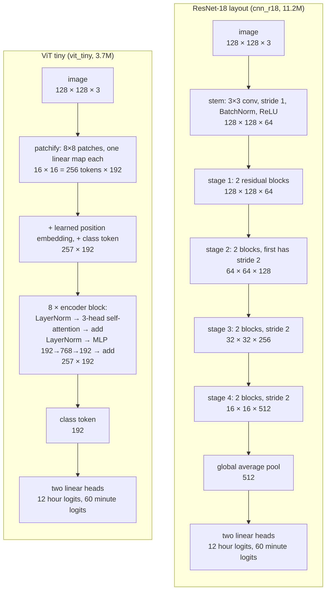
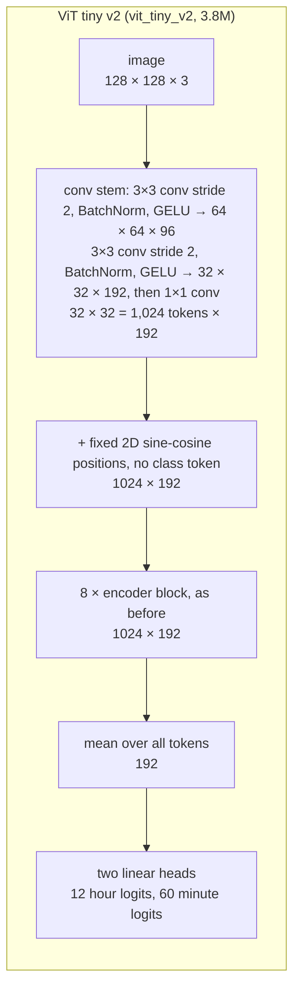
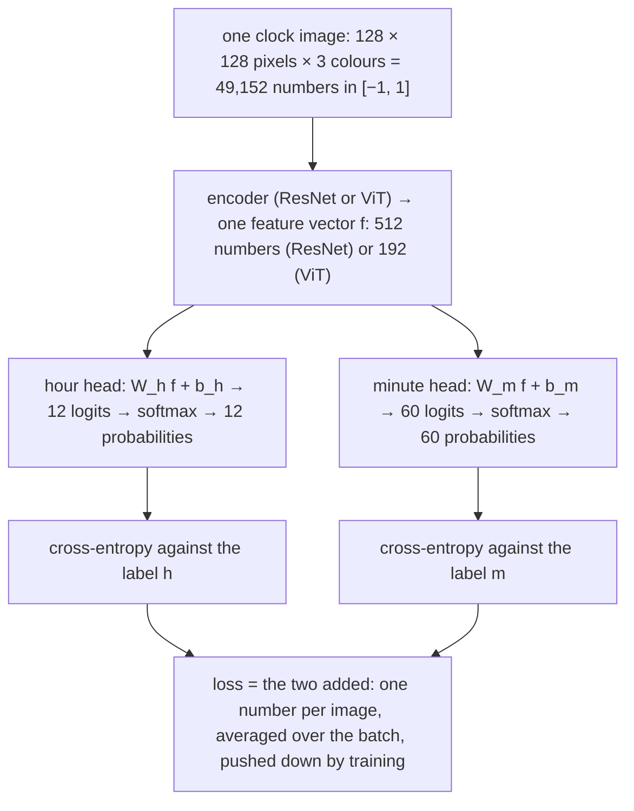

*Part 2 of [Lost in time](/blog/clocks/). [Part 1](/blog/clocks/part-1-data/)
built the data. This part trains on it.*

Six models, three from each family, every one from random initialisation.

The two families see an image in different ways. A convolutional network
(the ResNets here) slides small filters across the image, so its first
layers can only see a few pixels at a time and build up from local edges
to larger shapes. It doesn't care where in the image a shape is, because
the same filter runs everywhere. A Vision Transformer cuts the image into
square patches, turns each patch into a vector, and lets every patch
attend to every other from the first layer. It has no built-in notion of
"nearby" or "same shape somewhere else"; it has to learn those from data.
Clock reading is a geometry task, so the question is whether the
convolutional prior helps, or whether attention's global view is worth
more once it has enough data. The families are matched in parameter count
rather than in compute or training time, because the question is about
what a given amount of model can learn.

| model | params | design |
|---|---|---|
| cnn_small | 2.8M | ResNet, widths 32 to 256, two blocks per stage |
| cnn_r18 | 11.2M | ResNet-18 layout |
| cnn_r34 | 21.3M | ResNet-34 layout |
| vit_tiny | 3.7M | patch 8, width 192, depth 8, 3 heads |
| vit_small | 14.4M | patch 8, width 384, depth 8, 6 heads |
| vit_p16 | 14.5M | patch 16, width 384, depth 8, 6 heads |

Here are the two families as data flows, with the shape of the tensor at
each stage for a 128 px input. Read them top to bottom. The ResNet shrinks
the image four times while widening the channels; the ViT shrinks it once,
at the very start, and then keeps the same 256 tokens through every layer.

A residual block is two 3x3 convolutions with a skip connection that adds
the block's input to its output, so each block only has to learn a
correction. An encoder block is the transformer's unit: self-attention
lets every token gather information from every other token, weighted by
learned relevance, and the MLP then processes each token on its own. Both
families are deep stacks of one repeated unit; the difference is entirely
in what the unit does and what it can see.

The modified ViT in the second half of this post keeps the eight encoder
blocks and changes the three parts around them:

The ResNets [[ResNet]](#references) use a 3x3 stride-1 stem instead of the
ImageNet 7x7 stride-2 convolution plus max-pool. At 128 px the first thing a
stride-4 stem would throw away is the minute hand. The ViTs
[[ViT]](#references) are the plain recipe: one patch-by-patch strided
convolution as the tokeniser, learned position embeddings, a class token,
stochastic depth up to 0.1.

Both families end in the same head, and the head is where the task is
defined, so it gets its own section.

## What goes in, what comes out

Before the loss, the plumbing, because the loss only makes sense once the
input and output are concrete.

**The input** is one image, 128 by 128 pixels, three colour channels,
scaled from the 0 to 255 of the file to the range −1 to 1. That's 49,152
numbers. Nothing else goes in: no hint of where the centre is, no crop, no
mask. **The label** is two integers, the hour from 0 to 11 (0 meaning
twelve) and the minute from 0 to 59.

**The output** is two lists of probabilities: twelve for the hour, sixty
for the minute, each list summing to one. The model's answer is the
largest entry in each list. That's the whole interface; a person reading
the clock produces the same two numbers.

Here is the trained ViT doing it on two held-out clocks. The green bars
are the probabilities it produced, the red outline is the smoothed target
it was trained towards, and the number in the corner is the loss those two
things produce together:

{: .no-invert}

The top clock is the easy case: nearly all the probability on the right
hour and the right minute, and a loss of 1.26, within a hair of the floor.
The bottom clock is the boundary case that Part 3 is about. The hour is
certain. The minute head puts 73% on 55 and 14% on 54, and the label says 54. The
model isn't confused about the clock; it is reporting, honestly,
that the hand is between two minute marks and nearer the later one. The
loss for that image is 2.88, more than twice the floor, all of it from
the minute head, and all of it for being one minute late.

That is what "the loss" means for the rest of this post: for each image,
how far the model's two probability lists are from the target lists, added
up. Training is the process of nudging the encoder's weights so that
number, averaged over the batch, goes down.

## How a ViT turns the image into tokens

The ResNet consumes the 128 by 128 grid directly. The ViT can't: a
transformer works on a sequence of vectors, so the image has to be cut up
first. This step is called tokenising, and Part 2's main finding is that
it's where the plain ViTs go wrong, so here it is on the actual model.

{: .no-invert}

The image is cut into 16 by 16 squares of 8 by 8 pixels. Each square is
flattened into a list of 192 numbers (8 × 8 pixels × 3 colours) and
multiplied by one learned matrix $$E$$ of size 192 × 192, the same matrix
for every square. The result is the square's *token*: 192 numbers that are
all the transformer will ever know about those 64 pixels. A position
vector is added so the transformer can tell square (3, 7) from square
(12, 2), and the 256 tokens go into the encoder blocks.

Look at the six pulled-out patches. Patch *a* sits on the minute hand, *b*
on the hour hand, *c* on a numeral, *d* on the rim, and *e* and *f* are flat
background. Their tokens differ, which is what the matrix is for: the two
background tokens are nearly blank, the hand and numeral tokens are busy.
But the matrix cannot know that the hand in patch *a* points towards the
centre of the clock, because it never sees the centre; it sees 64 pixels. Every geometric fact about the hands has to be
reassembled by the attention layers from these local descriptions. The
smaller the patch, the more of the geometry survives into the tokens, and
the next section shows that in the results.

## The loss: two classifications, not one, and not a regression

Whatever the encoder is, it ends by producing a single vector
$$f \in \mathbb{R}^d$$ that summarises the image: the average of the last
feature map for the ResNet, the class token or the mean of all tokens for
the ViT. Two linear layers turn that vector into scores, one set of 12 for
the hour and one set of 60 for the minute. These raw scores are called
logits; a softmax turns them into probabilities that sum to one, and the
answer is the highest.

$$\ell_h = W_h f + b_h \in \mathbb{R}^{12}, \qquad \ell_m = W_m f + b_m \in \mathbb{R}^{60}.$$

The loss is the number training tries to push down. Here it's the sum of
two cross-entropies, one per head, each of which is the negative log
probability the model gave to the right answer, so it's zero when the model
is certain and correct, and large when it's confident and wrong. With label
smoothing $$\varepsilon = 0.1$$, the target isn't "all the probability on the
right class" but "90% on the right class, the rest spread evenly":

$$\mathcal{L} = \mathrm{CE}_\varepsilon(\ell_h, h) + \mathrm{CE}_\varepsilon(\ell_m, m), \qquad
\mathrm{CE}_\varepsilon(\ell, y) = -\sum_{c=1}^{C} q_c \log \mathrm{softmax}(\ell)_c, \quad
q_c = (1-\varepsilon)\,[c = y] + \frac{\varepsilon}{C}.$$

At inference each head takes its argmax. There were three other ways to set
this up, and each was rejected for a reason worth stating.

**One 720-way softmax over (hour, minute) pairs.** The most literal
framing: every time is a class. It's strictly harder to learn. Each class
sees 167 training examples instead of 10,000 (hour) or 2,000 (minute), and
the model gets no credit for reading one hand right when the other is
wrong. The two-head version factorises the problem the way a person does:
read each hand, then combine. The heads share the encoder, so the coupling
between hands that Part 1 described still has to be learned, but it's
learned in the features rather than in the output layer.

**Regression of the angles.** Predict
$$(\sin\theta_h, \cos\theta_h, \sin\theta_m, \cos\theta_m)$$ and decode
with $$\operatorname{atan2}$$.
This is the natural choice for a circular quantity, and it has one real
advantage over classification: minute 59 and minute 0 are neighbours in
target space rather than unrelated classes, so an almost-right answer costs
almost nothing. The loss would be

$$\mathcal{L}_{\text{angle}} = \lVert \hat{u} - u \rVert^2, \qquad u = (\sin\theta_h, \cos\theta_h, \sin\theta_m, \cos\theta_m),$$

or, per hand, $$1 - \cos(\hat\theta - \theta)$$, which is the same thing up
to a constant when the prediction has unit norm. I didn't run it, and
that's a gap. The head is in the code and the decoder is left as a stub,
because the decode step has a trap: the hour angle has to have the
minute's contribution subtracted before rounding,
$$h = \lfloor (\theta_h - \theta_m/12) / 30 \rfloor$$, or 4:58 decodes as
5:58. Part 3 shows why the
regression's advantage might matter: nearly every error the classifiers
make is off by exactly one minute, which is the case where classification
gives zero credit and regression gives almost full credit. Whether that
changes what the model *learns*, as opposed to how it's scored, is the
experiment to run.

**Cross-entropy without smoothing.** Label smoothing asks the model to be
90% sure rather than 100% sure. That sounds like a small thing. It is
standard
[[LabelSmoothing]](#references) and cheap, and on this task it has a
specific justification. Part 1 showed that the last minute is worth three
or four pixels, and after blur and JPEG some training images genuinely
don't contain it. Unsmoothed cross-entropy would push the model to be
certain on those images anyway, memorising noise. Smoothing caps the
confidence it's asked for. The floor it puts under the loss is also
visible in the curves below: the cross-entropy can't go below the entropy
of the smoothed target, $$0.53$$ nats for the 12-way head and $$0.72$$ for the
60-way head, so a perfect model scores $$1.25$$. The ResNets finish at
$$1.28$$.

What the loss does not do is know that minute 37 is closer to 38 than
to 12: every wrong minute costs the same. Part 3 measures whether that
matters, with a metric that does know: the circular minute error
$$\min(|\hat m - m|,\ 60 - |\hat m - m|)$$.

## Training

One epoch is one pass over all 120,000 training images, in batches
of 256. The optimiser is AdamW [[AdamW]](#references), the standard choice,
with betas 0.9 and 0.95, weight decay 0.05 on weight matrices only, bf16
autocast for speed, and peak learning rate
$$\eta = 2 \times 10^{-3}$$ for the CNNs and $$10^{-3}$$ for the ViTs, 30
epochs. The schedule is linear warmup for the first 5% of steps, then
cosine decay to zero over the rest:

$$\eta_t = \eta \cdot \begin{cases} t / t_w & t < t_w \\[4pt] \tfrac{1}{2}\left(1 + \cos \pi \dfrac{t - t_w}{T - t_w}\right) & t \ge t_w \end{cases}$$

with $$T$$ the total number of steps and $$t_w = 0.05\,T$$. On
top of what the renderer already varied, the loop adds a random shift of up
to 8 px and brightness and contrast jitter, computed on the GPU.

The stack is PyTorch 2.8 with CUDA 12.8, one RTX 4090, a `uv`-managed
environment, and no training framework: the loop is a hundred lines that
own the optimiser, the schedule and the logging. The whole training split
sits on the GPU as uint8, 5.9 GB, and each batch is gathered by index. There's no dataloader, no worker processes, and no
CPU-side decoding, so the small models are bounded by the forward and
backward pass: cnn_small trains 120k images per epoch in 37 seconds.

Two metrics matter. "Exact" means hour and minute are both right. "±1 min"
means the hour is right and the minute is within one of the truth. Every
number is from one seed, and the differences between models within a family
are inside single-seed noise. Part 3 quantifies that.

## Results at 30 epochs

Test set, 10,000 images with training-pool fonts, and the same on the
held-out fonts:

| model | params | exact | held-out fonts | hour | ±1 min | train time |
|---|---|---|---|---|---|---|
| cnn_r34 | 21.3M | 0.889 | 0.894 | 0.998 | 0.996 | 82 min |
| cnn_r18 | 11.2M | 0.881 | 0.889 | 0.998 | 0.995 | ~55 min |
| cnn_small | 2.8M | 0.878 | 0.880 | 0.997 | 0.995 | 19 min |
| vit_tiny | 3.7M | 0.546 | 0.544 | 0.946 | 0.894 | 12 min |
| vit_small | 14.4M | 0.422 | 0.432 | 0.829 | 0.724 | 29 min |
| vit_p16 | 14.5M | 0.074 | 0.075 | 0.261 | 0.139 | 7 min |

Read the table as a person would: the ResNets get about nine clocks in
ten exactly right and almost all of the rest within a minute, whether or
not they've seen the typeface. The plain ViTs get one in two, or worse.
Three things stand out.

**Held-out fonts cost nothing.** Every model scores the same, within noise,
on fonts it has never seen. The models read hands, not numerals, which is
what Part 1 hoped for. It also means the 250-font numeral rendering was
mostly wasted effort as far as accuracy goes. It still earns its keep by
making the rotation augmentation legal.

**Every good model hits the same wall.** The three CNNs land between 87.8%
and 88.9% exact, and all of them are at 99.5% within one minute and 99.7%
on the hour. Tripling the parameter count from cnn_small to cnn_r34 buys one
point. The 11% of misses are almost entirely off-by-one minutes. My first
hypothesis was a resolution ceiling: Part 1 worked out that one minute is
three or four pixels of hand-tip travel at 128 px, and blur, noise and JPEG
eat into that. It turned out to be mostly something else, and something I
built in myself. Part 3 has the analysis; the short version is that half the
clocks let the minute hand creep towards the next minute with the seconds,
and the label doesn't. The models are reading the hand correctly. The label
is what's ambiguous.

**Plain ViTs underfit, and get worse as they grow.** vit_tiny reaches 55%
exact, vit_small with four times the parameters reaches 42%, and vit_p16
barely learns the hour. The training loss in the right panel says what kind
of failure this is: the CNNs are at 1.3 after 30 epochs, the ViTs are at
2.4, 3.1 and 5.2. They aren't overfitting. They can't fit the training set.

## Why the tokeniser is the problem

The ViT paper [[ViT]](#references) says ViTs lose to CNNs on small data
without pre-training, because they lack the locality prior. That's true and
it isn't specific enough. The ordering here, patch 16 far worse than patch
8, and the bigger patch-8 model worse than the smaller one, points at the
first layer.

{: .no-invert}

As the tokeniser section showed, a plain ViT's first operation is to
flatten each patch into a list of pixel values and multiply it by one
fixed matrix to get a token. That
multiplication is the same for every patch, and it happens before the
model has looked at anything else. In symbols, For patch $$i$$ with pixels flattened into
$$x_i \in \mathbb{R}^{3p^2}$$,

$$z_i = E\,x_i + \mathrm{pos}_i, \qquad E \in \mathbb{R}^{d \times 3p^2},$$

with the same $$E$$ for every patch and a position vector $$\mathrm{pos}_i$$
that is added, not multiplied. Whatever $$E$$ can't express about a patch is
gone before any attention happens. With 16 px patches on a 128 px image the
clock is an 8x8 grid of 64 tokens. The minute hand lies inside two or three
of them, and its angle has to be recovered from 768 pixel values by a single
matrix multiply that is shared across every patch position. That projection
has no idea where the patch centre is relative to the clock centre, so it
can't compute an angle even in principle. It can only describe local
texture, and the attention layers then have to reconstruct geometry from
texture descriptions.

{: .no-invert}

Averaging each patch is a crude stand-in for what a linear projection keeps,
but it makes the point: at 16 px the hands are a smudge, at 8 px they are a
direction, at 4 px they are lines. A ResNet with a stride-1 stem sees the
lines from the first layer, and its convolutions are exactly the operation
that measures a line's orientation.

## Resolution, and what each model can see

Everything in this series is at 128 by 128 pixels, and that number is doing
more work than it looks. A clock at 128 px is roughly a wall clock seen
from across a room: you can tell the time, but you'd take a step closer to
be sure of the minute. Part 1 worked out that the minute-hand tip moves
$$2\pi r / 60$$ per minute, which for a typical face is three or four
pixels. The tip's *radius* scales with the image, so the budget scales
too:

{: .no-invert}

| image size | typical tip radius | pixels per minute |
|---|---|---|
| 64 px | 21 px | 2.2 |
| 128 px | 41 px | 4.3 |
| 192 px | 62 px | 6.5 |
| 256 px | 83 px | 8.7 |

At 64 px adjacent minutes are two pixels apart and blur alone would merge
them. At 256 px they're nearly nine apart and the last minute is no longer
in doubt. So resolution sets a floor on how well *any* model can do, and it
sets it per minute, not per clock.

What matters just as much is how much of that resolution each model
actually gets to use. The number to watch is the stride of the stem, the
factor by which the first block of the network shrinks the image before
the real layers see it:

| model | stem | first real layer sees | tokens or positions |
|---|---|---|---|
| ResNets (all three) | 3x3 conv, stride 1 | 128 x 128 | 16,384 positions |
| vit_p16 | 16x16 patches, stride 16 | 8 x 8 | 64 tokens |
| vit_tiny, vit_small | 8x8 patches, stride 8 | 16 x 16 | 256 tokens |
| vit_tiny_v2 | 3x3 convs to stride 4 | 32 x 32 | 1,024 tokens |

The ResNets keep every pixel until their own layers decide what to
discard, which is why a standard ImageNet ResNet, with its stride-4 stem,
was the wrong starting point: it would have thrown away three quarters of
the minute hand before its first residual block. The plain ViTs discard by
8 or 16 in one step, so their four-pixel minute is half a token wide at
best. The v2 stem discards by 4, in three gentle steps with a non-linearity
between each, which is enough to keep a hand as a line rather than a
smudge.

Why not give every ViT a stride-1 stem and be done? Cost. A transformer's
attention compares every token with every other, so its work grows with
the *square* of the token count. Doubling the image side quadruples the
tokens and multiplies attention by sixteen. At 128 px with stride 4 there
are 1,024 tokens, and each of the eight layers does about a million
token-pair comparisons; at 256 px with the same stem it would be sixteen
million. A convolution's cost grows only with the number of pixels. This
is the practical reason the two families are usually built differently,
and it's why testing the resolution floor is cheaper with cnn_small than
with any ViT.

The floor is worth testing because Part 3 finds that the models' misses
are almost all one minute late, and a resolution limit was my first
explanation for that. It turned out to be second: most of the effect is a
labelling choice in the renderer. But the 3% of errors that remain after
accounting for it are the kind of thing a four-pixel budget plus blur could
produce, and rendering at 192 px and retraining cnn_small is the experiment
that would settle it.

## Fixing the ViT

If the tokeniser is the problem, change the tokeniser. vit_tiny_v2 keeps the
same width and depth, 3.78M parameters against 3.7M, and makes three changes
that are each standard elsewhere:

- A convolutional stem [[EarlyConv]](#references): 3x3 stride-2
  convolutions stacked down to stride 4, instead of a single 8x8 stride-8
  patch projection. The network sees the hands at full resolution before
  tokenising, and there are 1,024 tokens instead of 256.
- Fixed 2D sine-cosine position embeddings instead of learned ones
  [[MAE]](#references). For a token at grid position $$(u, v)$$ the embedding
  is the concatenation of $$\sin(u\,\omega_k)$$, $$\cos(u\,\omega_k)$$,
  $$\sin(v\,\omega_k)$$, $$\cos(v\,\omega_k)$$ over $$d/4$$ frequencies
  $$\omega_k = 10000^{-4k/d}$$. The answer is a function of position about a
  centre, and this gives every token a precise, untrained coordinate from
  the first step.
- Global average pooling over tokens instead of a class token
  [[PlainViT]](#references).

It also trains for 100 epochs with a 10% warmup rather than 30 and 5%, which
makes the comparison unclean. I'll come back to that.

The run reached epoch 86 of 100 and stopped there. The machine rebooted with
the job paused, the GPU then fell off the PCIe bus, and I stopped the rerun
at epoch 26 rather than keep 380 W through a power cable I'd started to
distrust. So there is no finished 100-epoch model. What survives is the best
checkpoint through epoch 86, at 0.902 exact on validation, above every CNN's
best validation score (cnn_r34 peaked at 0.891). Evaluated afterwards on the
two test splits, on CPU:

| vit_tiny_v2, epoch 86 | exact | hour | minute | ±1 min | mean minute error |
|---|---|---|---|---|---|
| test, training fonts | 0.892 | 0.998 | 0.893 | 0.997 | 0.11 min |
| test, held-out fonts | 0.899 | 0.998 | 0.899 | 0.998 | 0.11 min |

A 3.8M-parameter ViT with a different tokeniser matches a 21M ResNet on
this task. Now the caveat. The ResNets got 30 epochs and the v2 ViT got 86
of a 100-epoch cosine. The green curve in the figure above is at 0.85 at
epoch 30, below the CNNs at the same point, with its learning rate still
high. The control that separates "better tokeniser" from "trained longer" is
the plain vit_tiny at 100 epochs, and it was next in the queue when the
sweep stopped, along with four ablations that each undo one change (patch 8,
plain patchify stem, learned positions, class token). Until those run, the
defensible claim is narrower: the three changes plus a longer schedule got a
tiny ViT past the CNNs, and the training loss says the tokeniser is doing
most of the work. v2's loss is 1.8 at epoch 30 and 1.3 at epoch 86, where
the plain vit_tiny never got below 2.4.

Two things I'd want before believing any ordering within a family. First,
more than one seed: two runs of vit_tiny_v2 with the same seed, differing
only in non-deterministic kernels, were 3.5 points apart on validation at
epoch 23. Second, the resolution test, because if the wall is pixels then
every model above is being compared on a task none of them can finish.

[Part 3 — What the models get wrong](/blog/clocks/part-3-evaluation/) looks
at the predictions themselves.

## References

- **[ViT]** Dosovitskiy et al., *An Image is Worth 16x16 Words: Transformers
  for Image Recognition at Scale*, ICLR 2021. arXiv:2010.11929.
- **[ResNet]** He et al., *Deep Residual Learning for Image Recognition*,
  CVPR 2016. arXiv:1512.03385.
- **[EarlyConv]** Xiao, Singh, Mintun, Darrell, Dollár & Girshick, *Early
  Convolutions Help Transformers See Better*, NeurIPS 2021. arXiv:2106.14881.
- **[MAE]** He et al., *Masked Autoencoders Are Scalable Vision Learners*,
  CVPR 2022. arXiv:2111.06377. Source of the fixed 2D sine-cosine position
  embedding.
- **[PlainViT]** Beyer, Zhai & Kolesnikov, *Better plain ViT baselines for
  ImageNet-1k*, 2022. arXiv:2205.01580. Global average pooling and sincos
  positions for small ViTs.
- **[AdamW]** Loshchilov & Hutter, *Decoupled Weight Decay Regularization*,
  ICLR 2019. arXiv:1711.05101.
- **[LabelSmoothing]** Szegedy et al., *Rethinking the Inception Architecture
  for Computer Vision*, CVPR 2016. arXiv:1512.00567. Introduces label
  smoothing.
