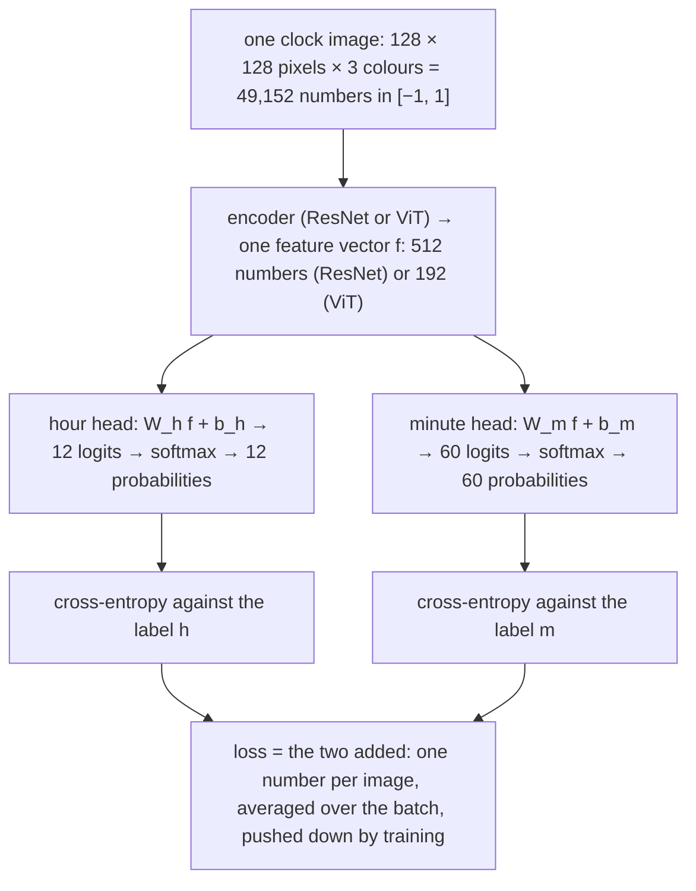
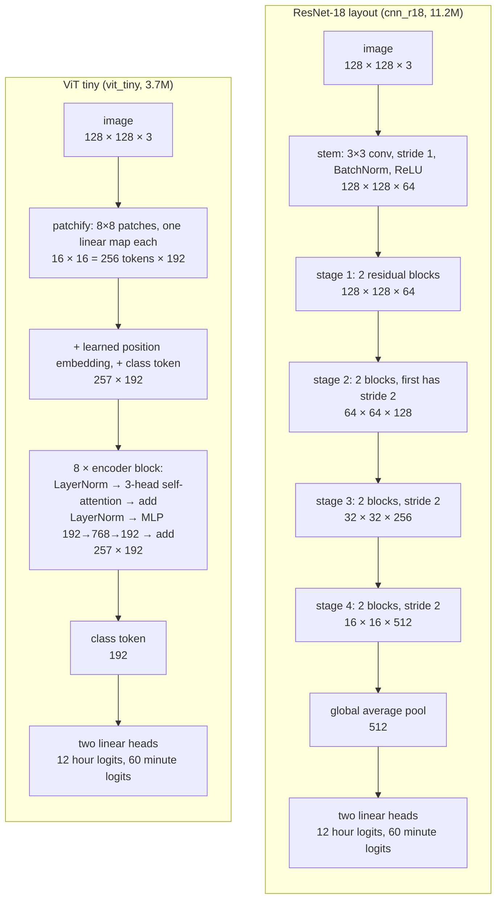
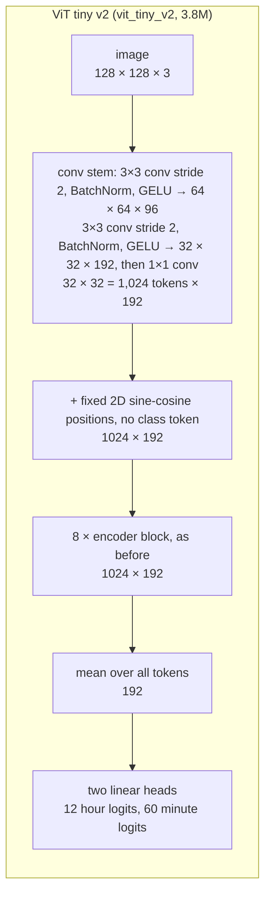

*Part 2 of [Lost in time](/blog/clocks/). [Part 1](/blog/clocks/part-1-data/)
built the data. This part trains on it.*

Six models, three from each family, every one from random initialisation.

The two families see an image in different ways. A convolutional network
(the ResNets here) slides small filters across the image, so its first
layers can only see a few pixels at a time and build up from local edges
to larger shapes. It doesn't care where in the image a shape is, because
the same filter runs everywhere. A Vision Transformer cuts the image into
square patches, turns each patch into a vector, and lets every patch
attend to every other from the first layer. It has no built-in notion of
"nearby" or "same shape somewhere else"; it has to learn those from data.
Clock reading is a geometry task, so the question is whether the
convolutional prior helps, or whether attention's global view is worth
more once it has enough data. The families are matched in parameter count
rather than in compute or training time, because the question is about
what a given amount of model can learn.

## What goes in, what comes out

Before the models, the plumbing. What goes in and what comes out is the
same for every model in this post, so it comes first (Figure 2.1).

**Figure 2.1.** From one image to one loss number: the data flow shared by every model in this post.
{: .figcap}

**The input** is one image, 128 by 128 pixels, three colour channels,
scaled from the 0 to 255 of the file to the range −1 to 1. That's 49,152
numbers. Nothing else goes in: no hint of where the centre is, no crop, no
mask. **The label** is two integers, the hour from 0 to 11 (0 meaning
twelve) and the minute from 0 to 59.

**The output** is two lists of probabilities: twelve for the hour, sixty
for the minute, each list summing to one. The model's answer is the
largest entry in each list.

Here is what that means as literal numbers, for one held-out clock. The
image is stored as three grids of 128 by 128 values, one for red, one for
green, one for blue, and a row of the actual values is printed under them.
Those 49,152 numbers are what the model receives. What it returns is
drawn on the right as two clocks. The hour clock has twelve sectors, one
per hour, and the minute clock sixty, one per minute; each sector is
shaded by the probability the model put on it, and the model's answer,
the darkest sector of each, is drawn as a hand (Figure 2.2).

{: .no-invert}

**Figure 2.2.** One clock through the model. Left: the input and its three colour channels. Right: its two outputs drawn as clocks, the twelve hour probabilities as sectors of one dial and the sixty minute probabilities as sectors of another. Darker means more probability; the solid hand is the model's answer with its value; the orange dashes mark the label.
{: .figcap}

The model put 0.94 on hour 9, and on the minute clock 0.73 on 55 and 0.14
on 54: two shaded sectors side by side, one dark, one pale. Its answer is
9:55. The label, the orange dashes, is 9:54. So this clock counts as a
miss, by one minute. Hold on to this example; the next figure puts an easy
clock beside it, and the loss section works out what the miss costs.

Figure 2.3 shows the same two clocks of probabilities for an easy clock
and then for the clock above, so the two cases can be compared.

{: .no-invert}

**Figure 2.3.** Two clocks through the trained ViT. Each row: the input, the hour probabilities as a twelve-sector clock, the minute probabilities as a sixty-sector clock. Solid hand: the model's answer. Orange dashes: the label.
{: .figcap}

The top row is the easy case. One dark green sector at 12, one dark blue
sector at 22, each hand on top of its dashes. The model gave 92% to the right
hour and 92% to the right minute. That is what a solved clock looks like,
and the loss section works out what it scores.

The bottom row is the boundary case that Part 3 is about. The hour clock
is as certain as before. But the minute clock has two shaded sectors: a
dark one at 55 and a lighter one at 54. The model put 73% on 55 and 14%
on 54, and the label says 54. Look at the input: the minute hand is
between the two marks, nearer 55. The model isn't confused about the
clock. It is reporting, in probabilities, exactly where the hand is. It's
marked wrong all the same, and the loss section shows what that costs.

The loss, which comes next, is a single number that says how far those
two probability lists are from the labelled answer. Training is the
process of nudging the encoder's weights so that number, averaged over the
batch, goes down.

## The two families

| model | params | design |
|---|---|---|
| cnn_small | 2.8M | ResNet, widths 32 to 256, two blocks per stage |
| cnn_r18 | 11.2M | ResNet-18 layout |
| cnn_r34 | 21.3M | ResNet-34 layout |
| vit_tiny | 3.7M | patch 8, width 192, depth 8, 3 heads |
| vit_small | 14.4M | patch 8, width 384, depth 8, 6 heads |
| vit_p16 | 14.5M | patch 16, width 384, depth 8, 6 heads |

Here are the two families as data flows, with the shape of the tensor at
each stage for a 128 px input. Read them top to bottom. The ResNet shrinks
the image four times while widening the channels; the ViT shrinks it once,
at the very start, and then keeps the same 256 tokens through every layer (Figure 2.4).

**Figure 2.4.** ResNet-18 and ViT tiny as data flows, with the tensor shape at each stage for a 128 px input.
{: .figcap}

A residual block is two 3x3 convolutions with a skip connection that adds
the block's input to its output, so each block only has to learn a
correction. An encoder block is the transformer's unit: self-attention
lets every token gather information from every other token, weighted by
learned relevance, and the MLP then processes each token on its own. Both
families are deep stacks of one repeated unit; the difference is entirely
in what the unit does and what it can see.

The ResNets [[ResNet]](#references) use a 3x3 stride-1 stem instead of the
ImageNet 7x7 stride-2 convolution plus max-pool; the resolution section
below says why. The ViTs
[[ViT]](#references) are the plain recipe: one patch-by-patch strided
convolution as the tokeniser, learned position embeddings, a class token,
stochastic depth up to 0.1.

## How a ViT turns the image into tokens

A ResNet takes the image as it is: a grid of pixels, and its filters slide
over that grid. A transformer can't do that. It was built for sentences,
where the input is a list of words, and it still needs its input as a
list. So before a Vision Transformer can look at a clock, the clock has to
be turned into a list. That step is the tokeniser, and it's the one place
where the plain ViTs in this post lose.

The analogy: cut the photo into 256 postage stamps, write a short
description of each stamp on the back, throw the stamps away and hand
someone the pile of descriptions. That's what the transformer receives.
It never sees the photo. Everything it works out about the clock, it
works out from the descriptions and from knowing which stamp each one
came from.

Here it is on the real model, following one stamp from the clock to its
description (Figure 2.5):

{: .no-invert}

**Figure 2.5.** One patch followed from the image to its token: cut, flatten to 192 numbers, multiply by the learned matrix E, add the position vector, one of 256 tokens. The clock is shown at 512 px for legibility.
{: .figcap}

Step by step, with the sizes:

1. **Cut.** The 128 by 128 image is divided into a 16 by 16 grid of
   patches, each 8 by 8 pixels. That's 256 patches. The yellow square is
   one of them, on the minute hand.
2. **Flatten.** Each patch is 8 × 8 pixels × 3 colours = 192 numbers. They
   are read off in a fixed order into one long list. The picture of the
   patch is gone; what's left is the list.
3. **Multiply.** The list is multiplied by a matrix with 192 rows and 192
   columns. Every entry of that matrix is a number the model learned
   during training, and it is the *same* matrix for all 256 patches. The
   result is a new list of 192 numbers.
4. **That new list is the token.** It's the description on the back of the
   stamp. Nothing else about those 64 pixels survives.
5. **Add the position.** A second list of 192 numbers, one per grid cell,
   also learned, is added to the token, so the transformer can tell a
   token from the top-left of the image from one at the centre.
6. **Repeat.** 256 patches give 256 tokens, a table of 256 rows and 192
   columns. That table, and only that table, goes into the encoder blocks.

In symbols, for patch $$i$$ with its 192 pixel values in the vector
$$x_i$$:

$$z_i = E\,x_i + \mathrm{pos}_i, \qquad E \in \mathbb{R}^{192 \times 192}.$$

What does step 3 actually compute? The clearest way to see it is to
think of each row of the matrix as a *template*: a tiny pattern the patch
is compared against. The token entry for that row is how strongly the
patch matches the pattern, a weighted sum of the pixel values. Figure 2.6
shrinks the whole thing to a size you can check by hand: a patch of four
grey pixels and a matrix with three rows, so the token has three numbers.

{: .no-invert}

**Figure 2.6.** A toy tokeniser. Top: a four-pixel patch, three template rows, the multiply-adds, and the three-number token they produce. Bottom: three of vit_tiny's 192 real templates, each 8 × 8 pixels × 3 colours, reshaped from rows of the learned matrix.
{: .figcap}

The three toy rows were chosen to have names: "average brightness", "top
minus bottom", "left minus right". Against a patch that is light on top
and dark below they return 0.05, 3.3 and 0.3, which reads as "mid-grey,
strong horizontal edge, no vertical edge". Three numbers, and the patch is
described. The real tokeniser is the same calculation with 192 pixel
values in and 192 numbers out, and its 192 templates were learned rather
than named, so they look like the colour grids at the bottom of the
figure: recognisable structure, no tidy meaning. The token is the list of
192 match scores against them.

Now the problem. The matrix in step 3 sees one patch at a time and never
sees the neighbours, so it cannot know that the hand in the yellow patch
points towards the centre of the clock: it has no idea where the centre
is. It
can say "there's a pink diagonal stripe in this stamp", and that's all it
can say. Every geometric fact about the hands, their angles about a shared
centre, has to be reconstructed by the attention layers afterwards from
256 such local descriptions. The bigger the patch, the more of the hand
disappears into one description before that reconstruction can start.
With 16 pixel patches the whole minute hand is two or three stamps. The
results section shows what that costs.

## The loss: two classifications, not one, and not a regression

The loss is where the two probability charts of the first section become
one number. Here it is in symbols, then worked out for the two clocks in
Figure 2.3, then the three other ways it could have been set up and why
they weren't. The encoder's summary vector $$f \in \mathbb{R}^d$$ (the
averaged last feature map for a ResNet, the class token or the mean token
for a ViT) goes through two linear layers, one per hand:

$$\ell_h = W_h f + b_h \in \mathbb{R}^{12}, \qquad \ell_m = W_m f + b_m \in \mathbb{R}^{60}.$$

Softmax turns each list of logits into probabilities:

$$p_c = \mathrm{softmax}(\ell)_c = \frac{e^{\ell_c}}{\sum_{j} e^{\ell_j}},$$

so the twelve hour probabilities sum to one and so do the sixty minute
probabilities. The target for each head is not "all the weight on the
labelled class" but a smoothed version with $$\varepsilon = 0.1$$:

$$q_c = (1-\varepsilon)\,[c = y] + \frac{\varepsilon}{C},$$

which puts 0.9 on the label and $$0.1/C$$ on every class, including the
label. The cross-entropy of one head is the sum over its classes of the
target weight times the negative log of the model's probability:

$$\mathrm{CE}_\varepsilon(p, y) = -\sum_{c=1}^{C} q_c \log p_c .$$

One image has two heads, so its loss is the hour head's cross-entropy
plus the minute head's, with $$C = 12$$ in the first and $$C = 60$$ in the
second:

$$\mathcal{L}_i = \mathrm{CE}_\varepsilon(p^{h}_i, h_i) + \mathrm{CE}_\varepsilon(p^{m}_i, m_i).$$

A batch has $$B = 256$$ images, and the number training pushes down is
their mean, $$\mathcal{L} = \frac{1}{B}\sum_i \mathcal{L}_i$$. Written out
in full, with the smoothed targets substituted in, that is

$$\mathcal{L} = \frac{1}{B} \sum_{i=1}^{B} \Bigg[
-\sum_{c=0}^{11} \Big( 0.9\,[c = h_i] + \tfrac{0.1}{12} \Big) \log p^{h}_{i,c}
\;-\; \sum_{c=0}^{59} \Big( 0.9\,[c = m_i] + \tfrac{0.1}{60} \Big) \log p^{m}_{i,c}
\Bigg].$$

That is the whole objective: two sums over classes, added, averaged over
the batch. The sum over classes is where the smoothing does its work.
Without it, only the labelled class's term survives (the others are
multiplied by zero); with it, every class contributes a little, and the
model is charged for putting probability *exactly* zero anywhere. Figure
2.7 shows the sum term by term for the boundary clock of Figure 2.3.

**Figure 2.7.** The loss, in three panels. Left: the penalty for giving the labelled class probability p is −log p, cheap near 1 and steep near 0; the easy clock and the boundary clock are marked. Middle: each head's cross-entropy split into the labelled class's term (coloured) and the other classes' terms (grey), for both clocks; the two heads add to the image's loss. Right: the losses of 256 held-out clocks, with the mean, which is the batch loss.
{: .figcap}

Read the middle panel. On the boundary clock the minute head's bar is
mostly blue: the labelled minute, 54, got probability 0.14 where 0.90 was
asked, so its term is $$-0.9 \log 0.14 = 1.75$$, most of the loss and all
of it for reading one minute late. The grey part, 0.60, is the sum of the
other fifty-nine terms, $$-(0.1/60)\log p_c$$ each: tiny on their own,
never zero. That grey is the smoothing's floor; it can't be reduced by
reading the clock better, only by never being completely sure of any
class. The hour head's bar is almost all grey, because the model gave the
right hour 0.94 and there is little to charge. The easy clock's bars are
nearly all grey on both heads: 1.26 in total, a hair above the 1.25 a
perfect model would score. The right panel is what the optimiser sees: a
batch of 256 such numbers, most near the floor, a tail of one-minute
misses, averaged to one value.

Same model, one minute off, and the loss more than doubles, from 1.26
to 2.88. At inference each head takes its argmax. There were three other
ways to set this up, and each was rejected for a reason worth stating.

**One 720-way softmax over (hour, minute) pairs.** The most literal
framing: every time is a class. It's strictly harder to learn. Each class
sees 167 training examples instead of 10,000 (hour) or 2,000 (minute), and
the model gets no credit for reading one hand right when the other is
wrong. The two-head version factorises the problem the way a person does:
read each hand, then combine. The heads share the encoder, so the coupling
between hands that Part 1 described still has to be learned, but it's
learned in the features rather than in the output layer.

**Regression of the angles.** Predict
$$(\sin\theta_h, \cos\theta_h, \sin\theta_m, \cos\theta_m)$$ and decode
with $$\operatorname{atan2}$$.
This is the natural choice for a circular quantity, and it has one real
advantage over classification: minute 59 and minute 0 are neighbours in
target space rather than unrelated classes, so an almost-right answer costs
almost nothing. The loss would be

$$\mathcal{L}_{\text{angle}} = \lVert \hat{u} - u \rVert^2, \qquad u = (\sin\theta_h, \cos\theta_h, \sin\theta_m, \cos\theta_m),$$

or, per hand, $$1 - \cos(\hat\theta - \theta)$$, which is the same thing up
to a constant when the prediction has unit norm. I didn't run it, and
that's a gap. The head is in the code and the decoder is left as a stub,
because the decode step has a trap: the hour angle has to have the
minute's contribution subtracted before rounding,
$$h = \lfloor (\theta_h - \theta_m/12) / 30 \rfloor$$, or 4:58 decodes as
5:58. Part 3 shows why the
regression's advantage might matter: nearly every error the classifiers
make is off by exactly one minute, which is the case where classification
gives zero credit and regression gives almost full credit. Whether that
changes what the model *learns*, as opposed to how it's scored, is the
experiment to run.

**Cross-entropy without smoothing.** The smoothed target $$q$$ above puts
90% on the right class and spreads the other 10% evenly, so the model is
asked to be 90% sure rather than certain. That sounds like a small thing.
It is standard [[LabelSmoothing]](#references) and cheap, and on this task
it has a specific justification. Part 1 showed that the last minute is worth three
or four pixels, and after blur and JPEG some training images genuinely
don't contain it. Unsmoothed cross-entropy would push the model to be
certain on those images anyway, memorising noise. Smoothing caps the
confidence it's asked for. The floor it puts under the loss is also
visible in the curves below: the cross-entropy can't go below the entropy
of the smoothed target, $$0.53$$ nats for the 12-way head and $$0.72$$ for the
60-way head, so a perfect model scores $$1.25$$. The ResNets finish at
$$1.28$$.

What the loss does not do is know that minute 37 is closer to 38 than
to 12: every wrong minute costs the same. Part 3 measures whether that
matters, with a metric that does know: the circular minute error
$$\min(|\hat m - m|,\ 60 - |\hat m - m|)$$.

## Training

One epoch is one pass over all 120,000 training images, in batches
of 256. The optimiser is AdamW [[AdamW]](#references), the standard choice,
with betas 0.9 and 0.95, weight decay 0.05 on weight matrices only, bf16
autocast for speed, and peak learning rate
$$\eta = 2 \times 10^{-3}$$ for the CNNs and $$10^{-3}$$ for the ViTs, 30
epochs. The schedule is linear warmup for the first 5% of steps, then
cosine decay to zero over the rest:

$$\eta_t = \eta \cdot \begin{cases} t / t_w & t < t_w \\[4pt] \tfrac{1}{2}\left(1 + \cos \pi \dfrac{t - t_w}{T - t_w}\right) & t \ge t_w \end{cases}$$

with $$T$$ the total number of steps and $$t_w = 0.05\,T$$. On
top of what the renderer already varied, the loop adds a random shift of up
to 8 px and brightness and contrast jitter, computed on the GPU.

The stack is PyTorch 2.8 with CUDA 12.8, one RTX 4090, a `uv`-managed
environment, and no training framework: the loop is a hundred lines that
own the optimiser, the schedule and the logging. The whole training split
sits on the GPU as uint8, 5.9 GB, and each batch is gathered by index. There's no dataloader, no worker processes, and no
CPU-side decoding, so the small models are bounded by the forward and
backward pass: cnn_small trains 120k images per epoch in 37 seconds.

Two metrics matter. "Exact" means hour and minute are both right. "±1 min"
means the hour is right and the minute is within one of the truth. Every
number is from one seed, and the differences between models within a family
are inside single-seed noise. Part 3 quantifies that.

## Results at 30 epochs

Test set, 10,000 images with training-pool fonts, and the same on the
held-out fonts:

| model | params | exact | held-out fonts | hour | ±1 min | train time |
|---|---|---|---|---|---|---|
| cnn_r34 | 21.3M | 0.889 | 0.894 | 0.998 | 0.996 | 82 min |
| cnn_r18 | 11.2M | 0.881 | 0.889 | 0.998 | 0.995 | ~55 min |
| cnn_small | 2.8M | 0.878 | 0.880 | 0.997 | 0.995 | 19 min |
| vit_tiny | 3.7M | 0.546 | 0.544 | 0.946 | 0.894 | 12 min |
| vit_small | 14.4M | 0.422 | 0.432 | 0.829 | 0.724 | 29 min |
| vit_p16 | 14.5M | 0.074 | 0.075 | 0.261 | 0.139 | 7 min |

Figure 2.8 shows how they got there, epoch by epoch.

**Figure 2.8.** Validation exact accuracy and training loss per epoch for all seven runs.
{: .figcap}

Read the table as a person would: the ResNets get about nine clocks in
ten exactly right and almost all of the rest within a minute, whether or
not they've seen the typeface. The plain ViTs get one in two, or worse.
Three things stand out.

**Held-out fonts cost nothing.** Every model scores the same, within noise,
on fonts it has never seen. The models read hands, not numerals, which is
what Part 1 hoped for. It also means the 250-font numeral rendering was
mostly wasted effort as far as accuracy goes. It still earns its keep by
making the rotation augmentation legal.

**Every good model hits the same wall.** The three CNNs land between 87.8%
and 88.9% exact, and all of them are at 99.5% within one minute and 99.7%
on the hour. Tripling the parameter count from cnn_small to cnn_r34 buys one
point. The 11% of misses are almost entirely off-by-one minutes. My first
hypothesis was a resolution ceiling (the pixel budget is worked out two
sections down). It turned out to be mostly something else, and something I
built in myself. Part 3 has the analysis; the short version is that half the
clocks let the minute hand creep towards the next minute with the seconds,
and the label doesn't. The models are reading the hand correctly. The label
is what's ambiguous.

**Plain ViTs underfit, and get worse as they grow.** vit_tiny reaches 55%
exact, vit_small with four times the parameters reaches 42%, and vit_p16
barely learns the hour. The training loss in the right panel says what kind
of failure this is: the CNNs are at 1.3 after 30 epochs, the ViTs are at
2.4, 3.1 and 5.2. They aren't overfitting. They can't fit the training set.

## Why the tokeniser is the problem

The ViT paper [[ViT]](#references) says ViTs lose to CNNs on small data
without pre-training, because they lack the locality prior. That's true and
it isn't specific enough. The ordering here, patch 16 far worse than patch
8, and the bigger patch-8 model worse than the smaller one, points at the
first layer (Figure 2.9).

{: .no-invert}

**Figure 2.9.** One clock under a 16, 8 and 4 px patch grid.
{: .figcap}

The tokeniser section followed one 8 px patch to its token. Now change
the patch size. With 16 px patches on a 128 px image the clock is an 8 by 8
grid of 64 tokens, each made from 768 pixel values, and the minute hand
lies inside two or three of them. Whatever the one matrix can't express
about those 768 values is gone before any attention happens, and the
matrix, applied to each patch alone, can't express "which way is the
centre". At 4 px the hand runs through a dozen tokens, each holding a
short piece of it, and the attention layers have a line to reassemble
rather than a smudge to guess from (Figure 2.10).

{: .no-invert}

**Figure 2.10.** The same clock as the mean of each 4, 8 and 16 px patch.
{: .figcap}

Averaging each patch is a crude stand-in for what a linear projection keeps,
but it makes the point: at 16 px the hands are a smudge, at 8 px they are a
direction, at 4 px they are lines. A ResNet with a stride-1 stem sees the
lines from the first layer, and its convolutions are exactly the operation
that measures a line's orientation.

## Resolution, and what each model can see

Everything in this series is at 128 by 128 pixels, and that number is doing
more work than it looks. A clock at 128 px is roughly a wall clock seen
from across a room: you can tell the time, but you'd take a step closer to
be sure of the minute. The minute-hand tip moves $$2\pi r / 60$$ per minute, which for a
typical face at 128 px is three or four pixels (Part 1 derived it). The
radius $$r$$ scales with the image, so the budget scales too (Figure 2.11):

{: .no-invert}

**Figure 2.11.** The same clock rendered at 64, 128 and 256 px.
{: .figcap}

| image size | typical tip radius | pixels per minute |
|---|---|---|
| 64 px | 21 px | 2.2 |
| 128 px | 41 px | 4.3 |
| 192 px | 62 px | 6.5 |
| 256 px | 83 px | 8.7 |

At 64 px adjacent minutes are two pixels apart and blur alone would merge
them. At 256 px they're nearly nine apart and the last minute is no longer
in doubt. So resolution sets a floor on how well *any* model can do, and it
sets it per minute, not per clock.

What matters just as much is how much of that resolution each model
actually gets to use. The number to watch is the stride of the stem, the
factor by which the first block of the network shrinks the image before
the real layers see it:

| model | stem | first real layer sees | tokens or positions |
|---|---|---|---|
| ResNets (all three) | 3x3 conv, stride 1 | 128 x 128 | 16,384 positions |
| vit_p16 | 16x16 patches, stride 16 | 8 x 8 | 64 tokens |
| vit_tiny, vit_small | 8x8 patches, stride 8 | 16 x 16 | 256 tokens |
| vit_tiny_v2 | 3x3 convs to stride 4 | 32 x 32 | 1,024 tokens |

The ResNets keep every pixel until their own layers decide what to
discard, which is why a standard ImageNet ResNet, with its stride-4 stem,
was the wrong starting point: it would have thrown away three quarters of
the minute hand before its first residual block. The plain ViTs discard by
8 or 16 in one step, so their four-pixel minute is half a token wide at
best. The v2 stem discards by 4, in three gentle steps with a non-linearity
between each, which is enough to keep a hand as a line rather than a
smudge.

Why not give every ViT a stride-1 stem and be done? Cost. A transformer's
attention compares every token with every other, so its work grows with
the *square* of the token count. Doubling the image side quadruples the
tokens and multiplies attention by sixteen. At 128 px with stride 4 there
are 1,024 tokens, and each of the eight layers does about a million
token-pair comparisons; at 256 px with the same stem it would be sixteen
million. A convolution's cost grows only with the number of pixels. This
is the practical reason the two families are usually built differently,
and it's why testing the resolution floor is cheaper with cnn_small than
with any ViT.

The floor is worth testing because Part 3 finds that the models' misses
are almost all one minute late, and a resolution limit was my first
explanation for that. It turned out to be second: most of the effect is a
labelling choice in the renderer. But the 3% of errors that remain after
accounting for it are the kind of thing a four-pixel budget plus blur could
produce, and rendering at 192 px and retraining cnn_small is the experiment
that would settle it.

## Fixing the ViT

If the tokeniser is the problem, change the tokeniser. vit_tiny_v2 keeps the
same width and depth, 3.78M parameters against 3.7M, and makes three changes
that are each standard elsewhere:

- A convolutional stem [[EarlyConv]](#references): 3x3 stride-2
  convolutions stacked down to stride 4, instead of a single 8x8 stride-8
  patch projection. The network sees the hands at full resolution before
  tokenising, and there are 1,024 tokens instead of 256.
- Fixed 2D sine-cosine position embeddings instead of learned ones
  [[MAE]](#references). For a token at grid position $$(u, v)$$ the embedding
  is the concatenation of $$\sin(u\,\omega_k)$$, $$\cos(u\,\omega_k)$$,
  $$\sin(v\,\omega_k)$$, $$\cos(v\,\omega_k)$$ over $$d/4$$ frequencies
  $$\omega_k = 10000^{-4k/d}$$. The answer is a function of position about a
  centre, and this gives every token a precise, untrained coordinate from
  the first step.
- Global average pooling over tokens instead of a class token
  [[PlainViT]](#references).

As a data flow, next to the plain ViT drawn earlier (Figure 2.12):

**Figure 2.12.** ViT tiny v2 as a data flow: a convolutional stem to stride 4, fixed sincos positions, average pooling.
{: .figcap}

It also trains for 100 epochs with a 10% warmup rather than 30 and 5%, which
makes the comparison unclean. I'll come back to that.

The run reached epoch 86 of 100 and stopped there, and the reason is worth
a paragraph because it decided what this post can and can't claim. The
machine rebooted with the job paused and the GPU then dropped off the PCIe
bus. I restarted the run from scratch, and about half an hour in the
room started to smell of hot plastic. The 16-pin power connector on the
4090, the one with a reputation, was too hot to keep a finger on. The card
was pulling 380 W and had been for hours. I killed the job at epoch 26
rather than find out how that story ends. So there is no finished
100-epoch model, and the rest of the ViT sweep, the control run and the
four ablations, never happened. What survives is the best
checkpoint through epoch 86, at 0.902 exact on validation, above every CNN's
best validation score (cnn_r34 peaked at 0.891). Evaluated afterwards on the
two test splits, on CPU:

| vit_tiny_v2, epoch 86 | exact | hour | minute | ±1 min | mean minute error |
|---|---|---|---|---|---|
| test, training fonts | 0.892 | 0.998 | 0.893 | 0.997 | 0.11 min |
| test, held-out fonts | 0.899 | 0.998 | 0.899 | 0.998 | 0.11 min |

Figure 2.13 puts every model on one chart.

**Figure 2.13.** Test exact accuracy against parameter count for every model.
{: .figcap}

So a 3.8M-parameter ViT with a different tokeniser ends up level with a
21M ResNet on this task. Here is the honest version of that sentence. The
ResNets got 30 epochs. The v2 ViT got 86 of a 100-epoch schedule, nearly
three times the training, and it needed them. At epoch 30, where the
ResNets stopped, its validation accuracy was 0.828, five to six points
below every ResNet's best. It did not pass the best ResNet's 0.891 until
epoch 63, and it reached its own best, 0.902, at epoch 85. On equal
training time the ResNets win, and the ViT would have needed still longer
to get clearly ahead.

What the three changes did was make the ViT *learn faster than a plain
ViT*, not faster than a CNN. That was the point of them: the plain
vit_tiny was going nowhere, with a training loss of 2.44 after 30 epochs
and no sign of fitting the data, so rather than pour more epochs or more
data into an architecture that couldn't see the hands, I changed the
part that couldn't see them. v2's training loss is 1.65 at epoch 30 and
1.3 at epoch 86; the ResNets are at 1.28 by epoch 30. The tokeniser
change closed most of the gap to the CNNs' learning speed, and the extra
epochs closed the rest.

The control that would separate "better tokeniser" from "trained longer"
is the plain vit_tiny at 100 epochs, and it was next in the queue when the
sweep stopped, along with four ablations that each undo one change (patch
8, plain patchify stem, learned positions, class token). Until those run,
the claim is what the numbers above support: with the tokeniser fixed and
three times the epochs, a tiny ViT matches the ResNets; with the same
epochs, it doesn't.

Two things I'd want before believing any ordering within a family. First,
more than one seed: two runs of vit_tiny_v2 with the same seed, differing
only in non-deterministic kernels, were 3.5 points apart on validation at
epoch 23. Second, the resolution test, because if the wall is pixels then
every model above is being compared on a task none of them can finish.

[Part 3 — What the models get wrong](/blog/clocks/part-3-evaluation/) looks
at the predictions themselves.

## References

- **[ViT]** Dosovitskiy et al., *An Image is Worth 16x16 Words: Transformers
  for Image Recognition at Scale*, ICLR 2021. arXiv:2010.11929.
- **[ResNet]** He et al., *Deep Residual Learning for Image Recognition*,
  CVPR 2016. arXiv:1512.03385.
- **[EarlyConv]** Xiao, Singh, Mintun, Darrell, Dollár & Girshick, *Early
  Convolutions Help Transformers See Better*, NeurIPS 2021. arXiv:2106.14881.
- **[MAE]** He et al., *Masked Autoencoders Are Scalable Vision Learners*,
  CVPR 2022. arXiv:2111.06377. Source of the fixed 2D sine-cosine position
  embedding.
- **[PlainViT]** Beyer, Zhai & Kolesnikov, *Better plain ViT baselines for
  ImageNet-1k*, 2022. arXiv:2205.01580. Global average pooling and sincos
  positions for small ViTs.
- **[AdamW]** Loshchilov & Hutter, *Decoupled Weight Decay Regularization*,
  ICLR 2019. arXiv:1711.05101.
- **[LabelSmoothing]** Szegedy et al., *Rethinking the Inception Architecture
  for Computer Vision*, CVPR 2016. arXiv:1512.00567. Introduces label
  smoothing.
